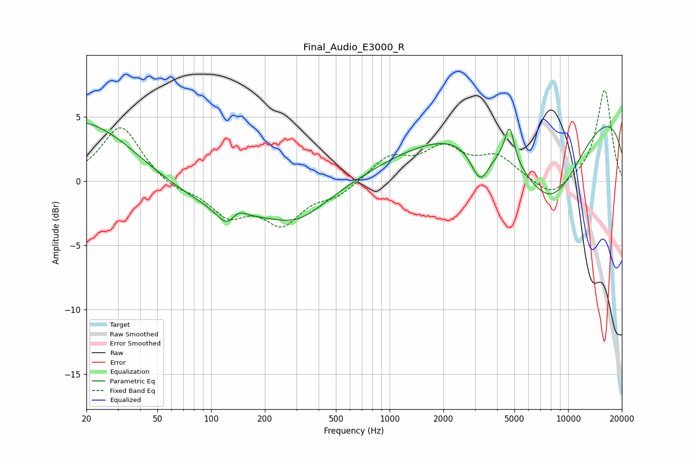

# Final_Audio_E3000_R
See [usage instructions](https://github.com/jaakkopasanen/AutoEq#usage) for more options and info.

### Parametric EQs
Apply preamp of -4.6 dB when using parametric equalizer.

|   # | Type    |   Fc (Hz) |    Q |   Gain (dB) |
|-----|---------|-----------|------|-------------|
|   1 | Peaking |        20 | 0.43 |         5.5 |
|   2 | Peaking |       128 | 2.25 |        -2.1 |
|   3 | Peaking |       139 | 2.97 |         1.5 |
|   4 | Peaking |       148 | 0.18 |        -2.7 |
|   5 | Peaking |       305 | 1    |        -1.4 |
|   6 | Peaking |      1075 | 0.39 |         1.9 |
|   7 | Peaking |      3217 | 2.59 |        -3   |
|   8 | Peaking |      4696 | 5.28 |         2.9 |
|   9 | Peaking |      7950 | 0.66 |        -7.7 |
|  10 | Peaking |     10000 | 0.18 |         6.7 |

### Fixed Band EQs
When using fixed band (also called graphic) equalizer, apply preamp of **-7.2 dB** (if available) and set gains manually with these parameters.

|   # | Type    |   Fc (Hz) |    Q |   Gain (dB) |
|-----|---------|-----------|------|-------------|
|   1 | Peaking |        31 | 1.41 |         4.4 |
|   2 | Peaking |        62 | 1.41 |        -0.7 |
|   3 | Peaking |       125 | 1.41 |        -2.4 |
|   4 | Peaking |       250 | 1.41 |        -3   |
|   5 | Peaking |       500 | 1.41 |        -1   |
|   6 | Peaking |      1000 | 1.41 |         1.8 |
|   7 | Peaking |      2000 | 1.41 |         2.3 |
|   8 | Peaking |      4000 | 1.41 |         1.7 |
|   9 | Peaking |      8000 | 1.41 |        -1.4 |
|  10 | Peaking |     16000 | 1.41 |         7.1 |

### Graphs

