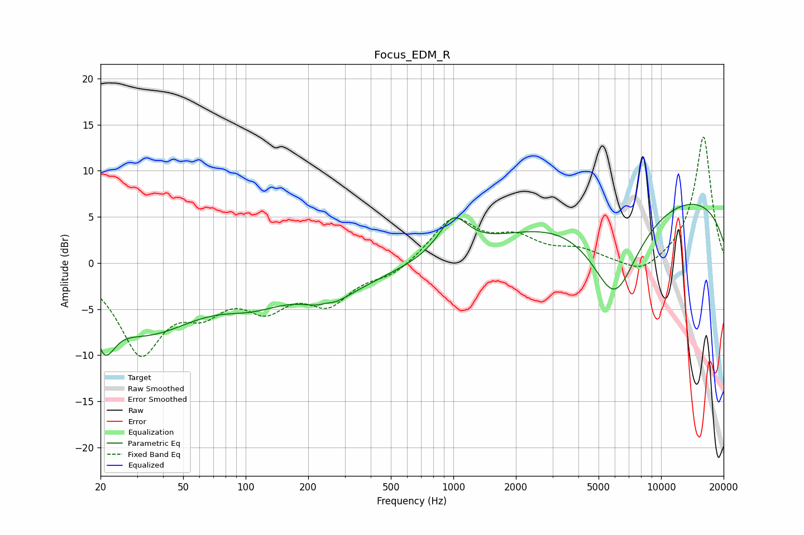

# Focus_EDM_R
See [usage instructions](https://github.com/jaakkopasanen/AutoEq#usage) for more options and info.

### Parametric EQs
Apply preamp of -6.5 dB when using parametric equalizer.

|   # | Type    |   Fc (Hz) |    Q |   Gain (dB) |
|-----|---------|-----------|------|-------------|
|   1 | Peaking |        21 | 4.19 |        -7.3 |
|   2 | Peaking |        21 | 5.62 |         3.3 |
|   3 | Peaking |        32 | 0.52 |        -7.2 |
|   4 | Peaking |       108 | 0.96 |        -2.1 |
|   5 | Peaking |       244 | 2.87 |         3.3 |
|   6 | Peaking |       245 | 2.4  |        -4.1 |
|   7 | Peaking |       262 | 0.62 |        -2.7 |
|   8 | Peaking |       999 | 2.03 |         3.9 |
|   9 | Peaking |      5978 | 1.12 |       -10.4 |
|  10 | Peaking |      9229 | 0.18 |         7.9 |

### Fixed Band EQs
When using fixed band (also called graphic) equalizer, apply preamp of **-13.8 dB** (if available) and set gains manually with these parameters.

|   # | Type    |   Fc (Hz) |    Q |   Gain (dB) |
|-----|---------|-----------|------|-------------|
|   1 | Peaking |        31 | 1.41 |        -9.3 |
|   2 | Peaking |        62 | 1.41 |        -3.7 |
|   3 | Peaking |       125 | 1.41 |        -4   |
|   4 | Peaking |       250 | 1.41 |        -3.9 |
|   5 | Peaking |       500 | 1.41 |        -1.3 |
|   6 | Peaking |      1000 | 1.41 |         4.8 |
|   7 | Peaking |      2000 | 1.41 |         2.3 |
|   8 | Peaking |      4000 | 1.41 |         1.2 |
|   9 | Peaking |      8000 | 1.41 |        -1.5 |
|  10 | Peaking |     16000 | 1.41 |        13.8 |

### Graphs

