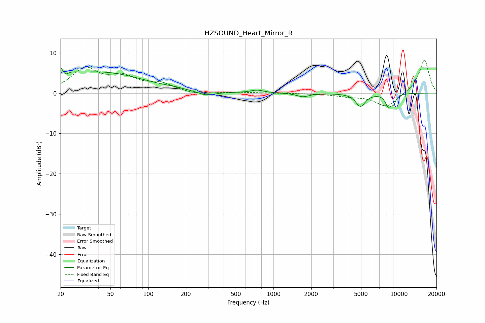

# HZSOUND_Heart_Mirror_R
See [usage instructions](https://github.com/jaakkopasanen/AutoEq#usage) for more options and info.

### Parametric EQs
Apply preamp of -6.4 dB when using parametric equalizer.

|   # | Type    |   Fc (Hz) |    Q |   Gain (dB) |
|-----|---------|-----------|------|-------------|
|   1 | Peaking |        20 | 2.71 |         4.8 |
|   2 | Peaking |        22 | 5    |        -3   |
|   3 | Peaking |        42 | 0.41 |         5   |
|   4 | Peaking |       161 | 2.92 |         0.2 |
|   5 | Peaking |       290 | 2.14 |        -1.1 |
|   6 | Peaking |       740 | 2.7  |         0.7 |
|   7 | Peaking |      1716 | 2.89 |        -0.9 |
|   8 | Peaking |      4945 | 3.65 |        -3.2 |
|   9 | Peaking |      8232 | 5.35 |        -2.8 |
|  10 | Peaking |      9067 | 6    |        -2   |

### Fixed Band EQs
When using fixed band (also called graphic) equalizer, apply preamp of **-8.3 dB** (if available) and set gains manually with these parameters.

|   # | Type    |   Fc (Hz) |    Q |   Gain (dB) |
|-----|---------|-----------|------|-------------|
|   1 | Peaking |        31 | 1.41 |         5.7 |
|   2 | Peaking |        62 | 1.41 |         3.5 |
|   3 | Peaking |       125 | 1.41 |         2.1 |
|   4 | Peaking |       250 | 1.41 |        -0.5 |
|   5 | Peaking |       500 | 1.41 |         0.2 |
|   6 | Peaking |      1000 | 1.41 |         0   |
|   7 | Peaking |      2000 | 1.41 |        -0.1 |
|   8 | Peaking |      4000 | 1.41 |        -0.7 |
|   9 | Peaking |      8000 | 1.41 |        -3.5 |
|  10 | Peaking |     16000 | 1.41 |         8.4 |

### Graphs

