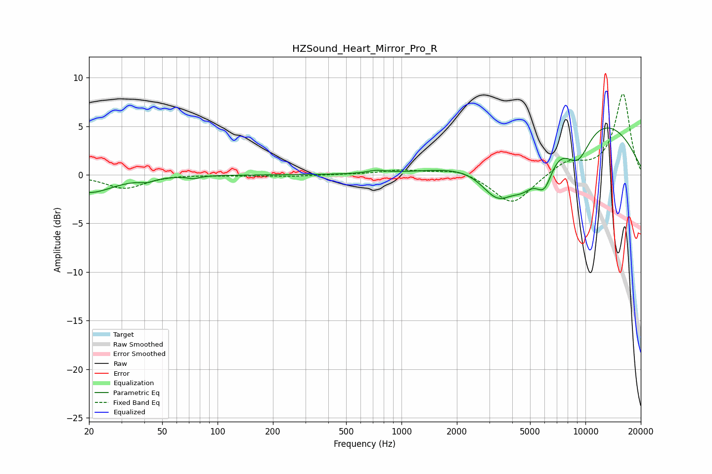

# HZSound_Heart_Mirror_Pro_R
See [usage instructions](https://github.com/jaakkopasanen/AutoEq#usage) for more options and info.

### Parametric EQs
Apply preamp of -4.9 dB when using parametric equalizer.

|   # | Type    |   Fc (Hz) |    Q |   Gain (dB) |
|-----|---------|-----------|------|-------------|
|   1 | Peaking |        20 | 1.1  |        -1.8 |
|   2 | Peaking |        41 | 3.59 |        -0.3 |
|   3 | Peaking |        74 | 4.63 |        -0.3 |
|   4 | Peaking |       730 | 3    |         0.3 |
|   5 | Peaking |      3346 | 1.42 |        -4.7 |
|   6 | Peaking |      4098 | 0.67 |         0.7 |
|   7 | Peaking |      4601 | 1.83 |        -3.1 |
|   8 | Peaking |      5975 | 2.68 |        -3.9 |
|   9 | Peaking |      9042 | 1.66 |        -4.1 |
|  10 | Peaking |      9540 | 0.31 |         6.5 |

### Fixed Band EQs
When using fixed band (also called graphic) equalizer, apply preamp of **-8.4 dB** (if available) and set gains manually with these parameters.

|   # | Type    |   Fc (Hz) |    Q |   Gain (dB) |
|-----|---------|-----------|------|-------------|
|   1 | Peaking |        31 | 1.41 |        -1.4 |
|   2 | Peaking |        62 | 1.41 |         0.1 |
|   3 | Peaking |       125 | 1.41 |        -0.1 |
|   4 | Peaking |       250 | 1.41 |        -0.1 |
|   5 | Peaking |       500 | 1.41 |         0   |
|   6 | Peaking |      1000 | 1.41 |         0.5 |
|   7 | Peaking |      2000 | 1.41 |         0.6 |
|   8 | Peaking |      4000 | 1.41 |        -3.1 |
|   9 | Peaking |      8000 | 1.41 |         1.4 |
|  10 | Peaking |     16000 | 1.41 |         8.3 |

### Graphs

