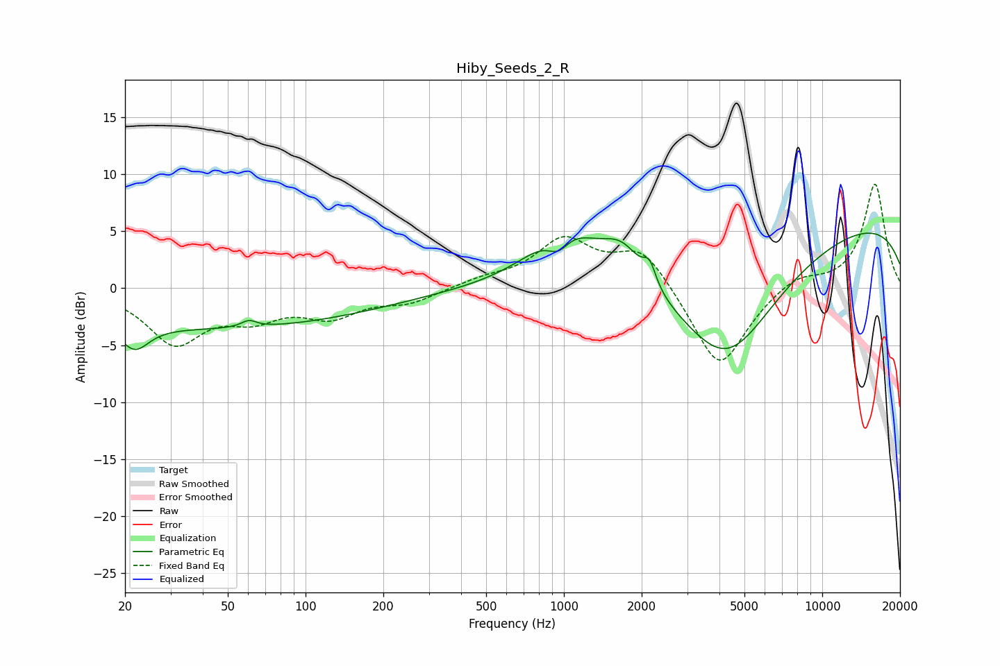

# Hiby_Seeds_2_R
See [usage instructions](https://github.com/jaakkopasanen/AutoEq#usage) for more options and info.

### Parametric EQs
Apply preamp of -4.9 dB when using parametric equalizer.

|   # | Type    |   Fc (Hz) |    Q |   Gain (dB) |
|-----|---------|-----------|------|-------------|
|   1 | Peaking |        22 | 2.61 |        -2.2 |
|   2 | Peaking |        44 | 0.22 |        -3.5 |
|   3 | Peaking |        60 | 4.94 |         0.6 |
|   4 | Peaking |       952 | 3.13 |        -1.9 |
|   5 | Peaking |      1000 | 1.06 |         5.2 |
|   6 | Peaking |      1606 | 1.85 |         1.6 |
|   7 | Peaking |      1756 | 2.08 |         1.5 |
|   8 | Peaking |      2144 | 5.8  |         1.9 |
|   9 | Peaking |      4268 | 0.66 |       -10.9 |
|  10 | Peaking |     10000 | 0.18 |         6.3 |

### Fixed Band EQs
When using fixed band (also called graphic) equalizer, apply preamp of **-9.2 dB** (if available) and set gains manually with these parameters.

|   # | Type    |   Fc (Hz) |    Q |   Gain (dB) |
|-----|---------|-----------|------|-------------|
|   1 | Peaking |        31 | 1.41 |        -4.6 |
|   2 | Peaking |        62 | 1.41 |        -2.1 |
|   3 | Peaking |       125 | 1.41 |        -2.2 |
|   4 | Peaking |       250 | 1.41 |        -1.1 |
|   5 | Peaking |       500 | 1.41 |         0.7 |
|   6 | Peaking |      1000 | 1.41 |         4.1 |
|   7 | Peaking |      2000 | 1.41 |         3.5 |
|   8 | Peaking |      4000 | 1.41 |        -7.3 |
|   9 | Peaking |      8000 | 1.41 |         1.2 |
|  10 | Peaking |     16000 | 1.41 |         9.2 |

### Graphs

