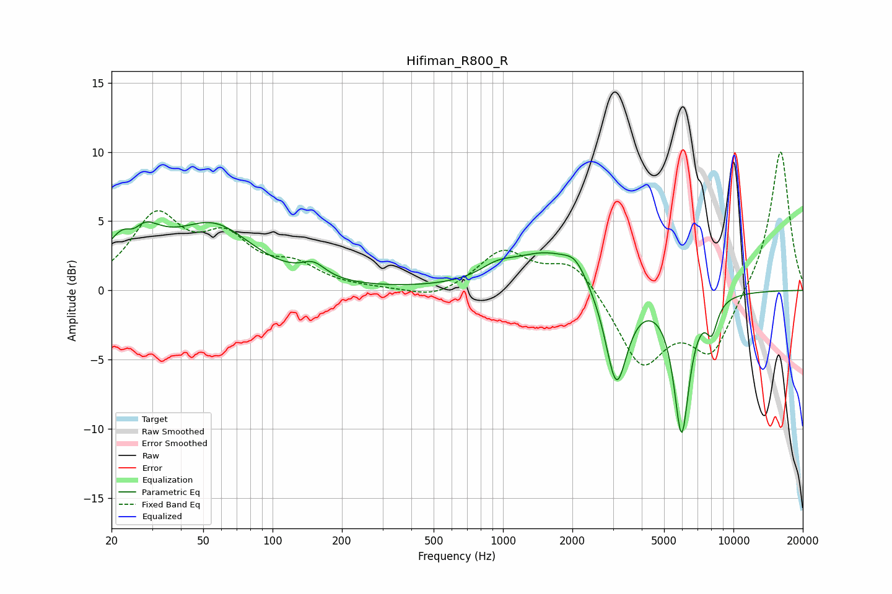

# Hifiman_R800_R
See [usage instructions](https://github.com/jaakkopasanen/AutoEq#usage) for more options and info.

### Parametric EQs
Apply preamp of -5.0 dB when using parametric equalizer.

|   # | Type    |   Fc (Hz) |    Q |   Gain (dB) |
|-----|---------|-----------|------|-------------|
|   1 | Peaking |        25 | 1.61 |         5   |
|   2 | Peaking |        25 | 3.43 |        -2   |
|   3 | Peaking |        56 | 0.81 |         4.3 |
|   4 | Peaking |       151 | 2.67 |         1   |
|   5 | Peaking |       946 | 1.87 |         0.8 |
|   6 | Peaking |      1564 | 0.92 |         2.7 |
|   7 | Peaking |      2063 | 2.96 |         1.1 |
|   8 | Peaking |      3104 | 2.95 |        -7.2 |
|   9 | Peaking |      5957 | 4.03 |       -10   |
|  10 | Peaking |      8059 | 5.28 |        -2.1 |

### Fixed Band EQs
When using fixed band (also called graphic) equalizer, apply preamp of **-10.1 dB** (if available) and set gains manually with these parameters.

|   # | Type    |   Fc (Hz) |    Q |   Gain (dB) |
|-----|---------|-----------|------|-------------|
|   1 | Peaking |        31 | 1.41 |         5.1 |
|   2 | Peaking |        62 | 1.41 |         3.3 |
|   3 | Peaking |       125 | 1.41 |         1.5 |
|   4 | Peaking |       250 | 1.41 |         0.1 |
|   5 | Peaking |       500 | 1.41 |        -0.7 |
|   6 | Peaking |      1000 | 1.41 |         2.8 |
|   7 | Peaking |      2000 | 1.41 |         2.2 |
|   8 | Peaking |      4000 | 1.41 |        -5.3 |
|   9 | Peaking |      8000 | 1.41 |        -4.4 |
|  10 | Peaking |     16000 | 1.41 |        10.3 |

### Graphs

