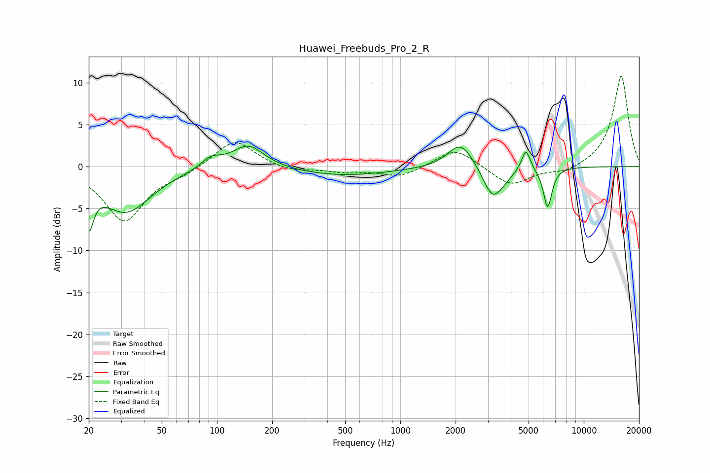

# Huawei_Freebuds_Pro_2_R
See [usage instructions](https://github.com/jaakkopasanen/AutoEq#usage) for more options and info.

### Parametric EQs
Apply preamp of -2.5 dB when using parametric equalizer.

|   # | Type    |   Fc (Hz) |    Q |   Gain (dB) |
|-----|---------|-----------|------|-------------|
|   1 | Peaking |        20 | 5.6  |        -5   |
|   2 | Peaking |        32 | 1.03 |        -5.3 |
|   3 | Peaking |        93 | 2.57 |         1.2 |
|   4 | Peaking |       148 | 1.59 |         2.8 |
|   5 | Peaking |       481 | 0.53 |        -1.1 |
|   6 | Peaking |      2128 | 2.06 |         3.1 |
|   7 | Peaking |      3150 | 2.89 |        -3.1 |
|   8 | Peaking |      3564 | 2.5  |        -1.1 |
|   9 | Peaking |      4835 | 5.95 |         2.6 |
|  10 | Peaking |      6354 | 5.83 |        -4.8 |

### Fixed Band EQs
When using fixed band (also called graphic) equalizer, apply preamp of **-10.9 dB** (if available) and set gains manually with these parameters.

|   # | Type    |   Fc (Hz) |    Q |   Gain (dB) |
|-----|---------|-----------|------|-------------|
|   1 | Peaking |        31 | 1.41 |        -6.5 |
|   2 | Peaking |        62 | 1.41 |        -0.7 |
|   3 | Peaking |       125 | 1.41 |         3.3 |
|   4 | Peaking |       250 | 1.41 |        -0.6 |
|   5 | Peaking |       500 | 1.41 |        -0.6 |
|   6 | Peaking |      1000 | 1.41 |        -1.2 |
|   7 | Peaking |      2000 | 1.41 |         2.3 |
|   8 | Peaking |      4000 | 1.41 |        -2.3 |
|   9 | Peaking |      8000 | 1.41 |        -0.8 |
|  10 | Peaking |     16000 | 1.41 |        10.9 |

### Graphs

