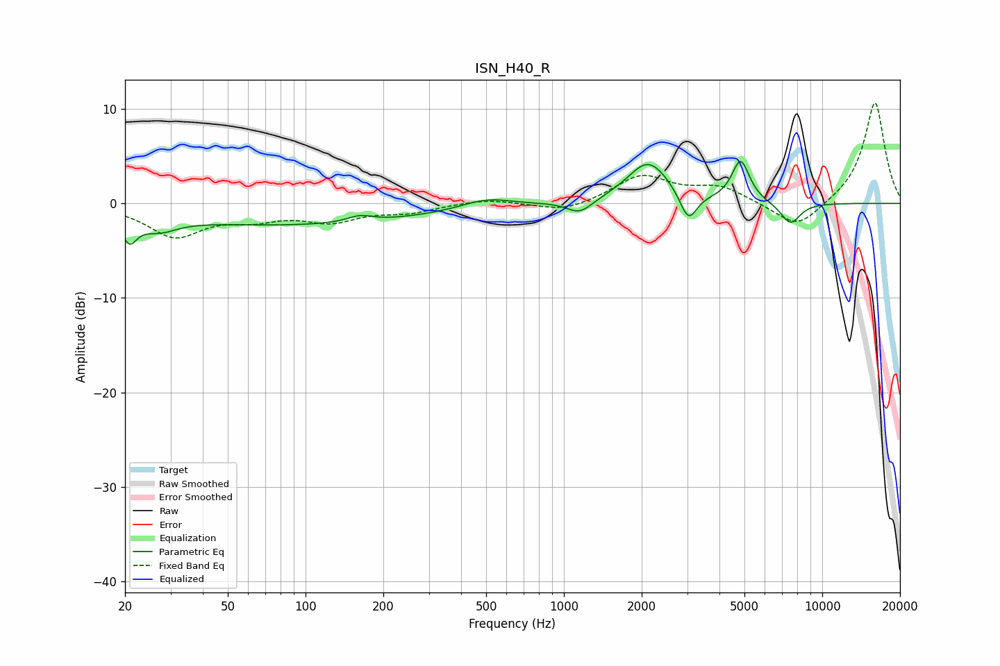

# ISN_H40_R
See [usage instructions](https://github.com/jaakkopasanen/AutoEq#usage) for more options and info.

### Parametric EQs
Apply preamp of -4.5 dB when using parametric equalizer.

|   # | Type    |   Fc (Hz) |    Q |   Gain (dB) |
|-----|---------|-----------|------|-------------|
|   1 | Peaking |        21 | 4.99 |        -2.5 |
|   2 | Peaking |        27 | 1.96 |        -1.5 |
|   3 | Peaking |        88 | 0.26 |        -2.3 |
|   4 | Peaking |       163 | 2.93 |         0.7 |
|   5 | Peaking |       501 | 1.45 |         1   |
|   6 | Peaking |      1151 | 2.86 |        -1.4 |
|   7 | Peaking |      2125 | 1.73 |         4.4 |
|   8 | Peaking |      3034 | 4.29 |        -3.1 |
|   9 | Peaking |      4834 | 4.09 |         4.4 |
|  10 | Peaking |      7532 | 3.44 |        -2.3 |

### Fixed Band EQs
When using fixed band (also called graphic) equalizer, apply preamp of **-10.7 dB** (if available) and set gains manually with these parameters.

|   # | Type    |   Fc (Hz) |    Q |   Gain (dB) |
|-----|---------|-----------|------|-------------|
|   1 | Peaking |        31 | 1.41 |        -3.4 |
|   2 | Peaking |        62 | 1.41 |        -1.3 |
|   3 | Peaking |       125 | 1.41 |        -1.7 |
|   4 | Peaking |       250 | 1.41 |        -0.8 |
|   5 | Peaking |       500 | 1.41 |         0.5 |
|   6 | Peaking |      1000 | 1.41 |        -1   |
|   7 | Peaking |      2000 | 1.41 |         2.9 |
|   8 | Peaking |      4000 | 1.41 |         1.6 |
|   9 | Peaking |      8000 | 1.41 |        -2.8 |
|  10 | Peaking |     16000 | 1.41 |        10.8 |

### Graphs

