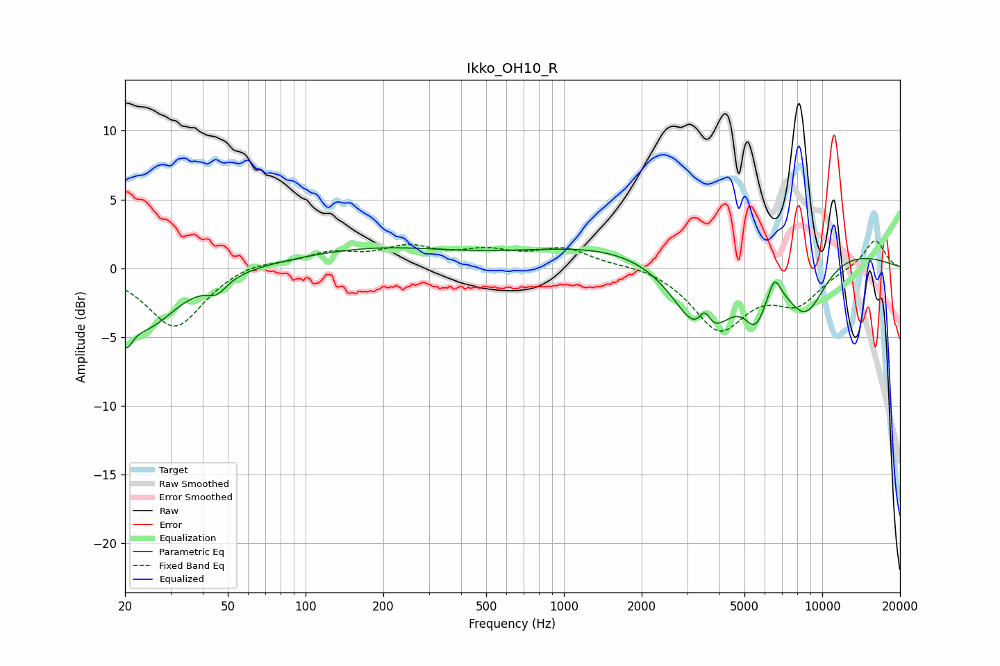

# Ikko_OH10_R
See [usage instructions](https://github.com/jaakkopasanen/AutoEq#usage) for more options and info.

### Parametric EQs
Apply preamp of -1.6 dB when using parametric equalizer.

|   # | Type    |   Fc (Hz) |    Q |   Gain (dB) |
|-----|---------|-----------|------|-------------|
|   1 | Peaking |        20 | 5.15 |        -2.4 |
|   2 | Peaking |        24 | 1.14 |        -4.1 |
|   3 | Peaking |        45 | 3.61 |        -1   |
|   4 | Peaking |       185 | 0.46 |         1.4 |
|   5 | Peaking |      3487 | 1.21 |        -6.9 |
|   6 | Peaking |      3506 | 6    |         1.6 |
|   7 | Peaking |      4141 | 0.18 |         2.6 |
|   8 | Peaking |      5519 | 3.2  |        -2.9 |
|   9 | Peaking |      6535 | 5.88 |         1.5 |
|  10 | Peaking |      8611 | 1.53 |        -4.5 |

### Fixed Band EQs
When using fixed band (also called graphic) equalizer, apply preamp of **-2.1 dB** (if available) and set gains manually with these parameters.

|   # | Type    |   Fc (Hz) |    Q |   Gain (dB) |
|-----|---------|-----------|------|-------------|
|   1 | Peaking |        31 | 1.41 |        -4.4 |
|   2 | Peaking |        62 | 1.41 |         0.6 |
|   3 | Peaking |       125 | 1.41 |         1   |
|   4 | Peaking |       250 | 1.41 |         1.3 |
|   5 | Peaking |       500 | 1.41 |         1   |
|   6 | Peaking |      1000 | 1.41 |         1.3 |
|   7 | Peaking |      2000 | 1.41 |         0.3 |
|   8 | Peaking |      4000 | 1.41 |        -4.4 |
|   9 | Peaking |      8000 | 1.41 |        -2.3 |
|  10 | Peaking |     16000 | 1.41 |         2.2 |

### Graphs

