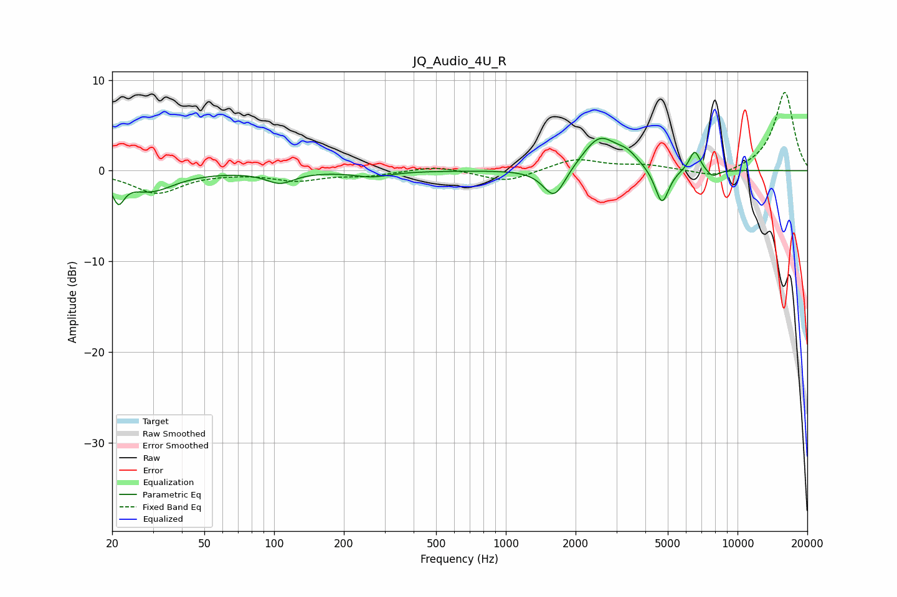

# JQ_Audio_4U_R
See [usage instructions](https://github.com/jaakkopasanen/AutoEq#usage) for more options and info.

### Parametric EQs
Apply preamp of -3.7 dB when using parametric equalizer.

|   # | Type    |   Fc (Hz) |    Q |   Gain (dB) |
|-----|---------|-----------|------|-------------|
|   1 | Peaking |        21 | 5.69 |        -2.6 |
|   2 | Peaking |        29 | 1.4  |        -2.1 |
|   3 | Peaking |       106 | 2.35 |        -1.3 |
|   4 | Peaking |       264 | 1.83 |        -0.6 |
|   5 | Peaking |      1619 | 2.94 |        -3.4 |
|   6 | Peaking |      2540 | 1.88 |         3.7 |
|   7 | Peaking |      3346 | 2.98 |         1.1 |
|   8 | Peaking |      4719 | 4.65 |        -4   |
|   9 | Peaking |      6537 | 5.87 |         2.3 |
|  10 | Peaking |      7795 | 5.09 |        -0.8 |

### Fixed Band EQs
When using fixed band (also called graphic) equalizer, apply preamp of **-8.7 dB** (if available) and set gains manually with these parameters.

|   # | Type    |   Fc (Hz) |    Q |   Gain (dB) |
|-----|---------|-----------|------|-------------|
|   1 | Peaking |        31 | 1.41 |        -2.4 |
|   2 | Peaking |        62 | 1.41 |        -0.1 |
|   3 | Peaking |       125 | 1.41 |        -1   |
|   4 | Peaking |       250 | 1.41 |        -0.5 |
|   5 | Peaking |       500 | 1.41 |         0.6 |
|   6 | Peaking |      1000 | 1.41 |        -1.3 |
|   7 | Peaking |      2000 | 1.41 |         1.3 |
|   8 | Peaking |      4000 | 1.41 |         0.5 |
|   9 | Peaking |      8000 | 1.41 |        -0.9 |
|  10 | Peaking |     16000 | 1.41 |         8.7 |

### Graphs

