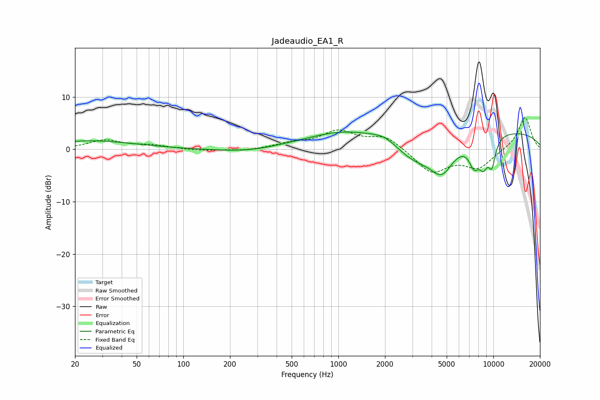

# Jadeaudio_EA1_R
See [usage instructions](https://github.com/jaakkopasanen/AutoEq#usage) for more options and info.

### Parametric EQs
Apply preamp of -3.4 dB when using parametric equalizer.

|   # | Type    |   Fc (Hz) |    Q |   Gain (dB) |
|-----|---------|-----------|------|-------------|
|   1 | Peaking |        25 | 0.5  |         1.6 |
|   2 | Peaking |       256 | 0.75 |        -0.7 |
|   3 | Peaking |      1127 | 0.53 |         3.4 |
|   4 | Peaking |      1998 | 1.72 |         1.4 |
|   5 | Peaking |      3111 | 0.96 |        -4.4 |
|   6 | Peaking |      4661 | 1.83 |        -5.5 |
|   7 | Peaking |      7529 | 3.79 |        -4.4 |
|   8 | Peaking |      8633 | 4.38 |        -4   |
|   9 | Peaking |      9785 | 5.08 |        -4.9 |
|  10 | Peaking |     10000 | 0.23 |         3.7 |

### Fixed Band EQs
When using fixed band (also called graphic) equalizer, apply preamp of **-6.1 dB** (if available) and set gains manually with these parameters.

|   # | Type    |   Fc (Hz) |    Q |   Gain (dB) |
|-----|---------|-----------|------|-------------|
|   1 | Peaking |        31 | 1.41 |         1.7 |
|   2 | Peaking |        62 | 1.41 |         0.7 |
|   3 | Peaking |       125 | 1.41 |        -0.3 |
|   4 | Peaking |       250 | 1.41 |        -0.3 |
|   5 | Peaking |       500 | 1.41 |         1   |
|   6 | Peaking |      1000 | 1.41 |         3.3 |
|   7 | Peaking |      2000 | 1.41 |         2.5 |
|   8 | Peaking |      4000 | 1.41 |        -4.4 |
|   9 | Peaking |      8000 | 1.41 |        -3.4 |
|  10 | Peaking |     16000 | 1.41 |         6.3 |

### Graphs

