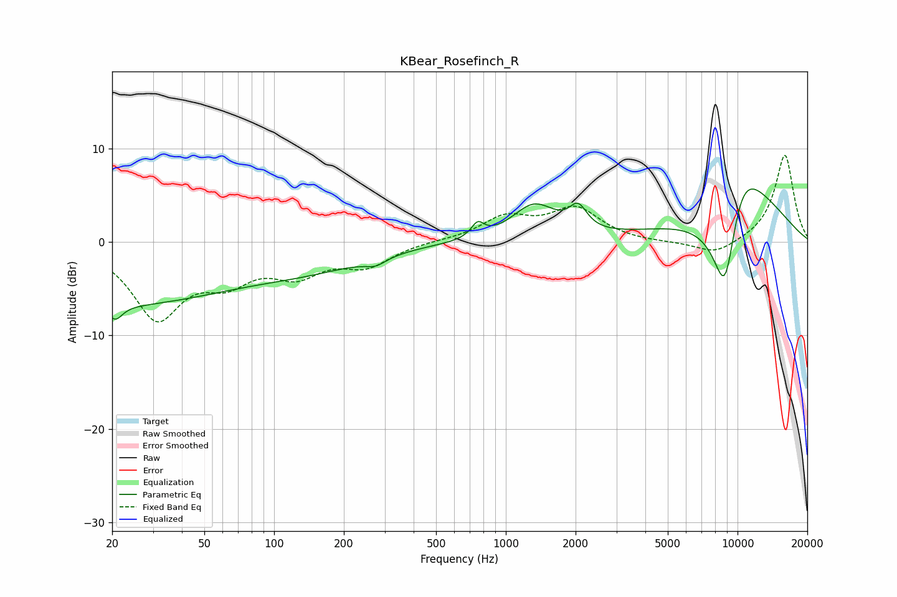

# KBear_Rosefinch_R
See [usage instructions](https://github.com/jaakkopasanen/AutoEq#usage) for more options and info.

### Parametric EQs
Apply preamp of -5.8 dB when using parametric equalizer.

|   # | Type    |   Fc (Hz) |    Q |   Gain (dB) |
|-----|---------|-----------|------|-------------|
|   1 | Peaking |        20 | 0.26 |        -6.6 |
|   2 | Peaking |        21 | 4.71 |        -1.5 |
|   3 | Peaking |       145 | 0.54 |        -2   |
|   4 | Peaking |       260 | 3.5  |         1.1 |
|   5 | Peaking |       265 | 3.09 |        -1.9 |
|   6 | Peaking |       756 | 5.18 |         1.5 |
|   7 | Peaking |      1324 | 1.49 |         3.8 |
|   8 | Peaking |      2051 | 3.74 |         2.4 |
|   9 | Peaking |      8851 | 1.6  |       -16.8 |
|  10 | Peaking |     10000 | 0.85 |        14.9 |

### Fixed Band EQs
When using fixed band (also called graphic) equalizer, apply preamp of **-9.4 dB** (if available) and set gains manually with these parameters.

|   # | Type    |   Fc (Hz) |    Q |   Gain (dB) |
|-----|---------|-----------|------|-------------|
|   1 | Peaking |        31 | 1.41 |        -7.8 |
|   2 | Peaking |        62 | 1.41 |        -3.3 |
|   3 | Peaking |       125 | 1.41 |        -3   |
|   4 | Peaking |       250 | 1.41 |        -2.3 |
|   5 | Peaking |       500 | 1.41 |         0.1 |
|   6 | Peaking |      1000 | 1.41 |         2.5 |
|   7 | Peaking |      2000 | 1.41 |         3.4 |
|   8 | Peaking |      4000 | 1.41 |        -0.1 |
|   9 | Peaking |      8000 | 1.41 |        -1.5 |
|  10 | Peaking |     16000 | 1.41 |         9.4 |

### Graphs

