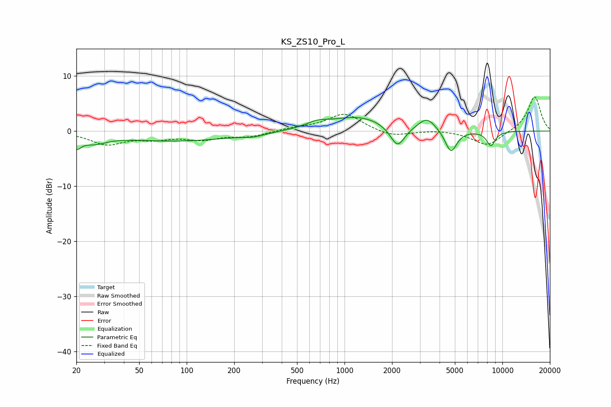

# KS_ZS10_Pro_L
See [usage instructions](https://github.com/jaakkopasanen/AutoEq#usage) for more options and info.

### Parametric EQs
Apply preamp of -2.6 dB when using parametric equalizer.

|   # | Type    |   Fc (Hz) |    Q |   Gain (dB) |
|-----|---------|-----------|------|-------------|
|   1 | Peaking |        20 | 4.81 |        -2   |
|   2 | Peaking |        26 | 1.76 |        -1.5 |
|   3 | Peaking |        87 | 0.39 |        -1.8 |
|   4 | Peaking |       267 | 2.1  |        -0.5 |
|   5 | Peaking |       667 | 2.14 |         0.9 |
|   6 | Peaking |      1218 | 0.76 |         2.6 |
|   7 | Peaking |      2164 | 3.04 |        -4   |
|   8 | Peaking |      3327 | 2.57 |         2.3 |
|   9 | Peaking |      4722 | 3.81 |        -4.1 |
|  10 | Peaking |      8463 | 4.58 |        -2.6 |

### Fixed Band EQs
When using fixed band (also called graphic) equalizer, apply preamp of **-6.3 dB** (if available) and set gains manually with these parameters.

|   # | Type    |   Fc (Hz) |    Q |   Gain (dB) |
|-----|---------|-----------|------|-------------|
|   1 | Peaking |        31 | 1.41 |        -2.3 |
|   2 | Peaking |        62 | 1.41 |        -1.1 |
|   3 | Peaking |       125 | 1.41 |        -1.4 |
|   4 | Peaking |       250 | 1.41 |        -0.9 |
|   5 | Peaking |       500 | 1.41 |         0.5 |
|   6 | Peaking |      1000 | 1.41 |         3.2 |
|   7 | Peaking |      2000 | 1.41 |        -1.1 |
|   8 | Peaking |      4000 | 1.41 |         0.2 |
|   9 | Peaking |      8000 | 1.41 |        -2.7 |
|  10 | Peaking |     16000 | 1.41 |         6.4 |

### Graphs

