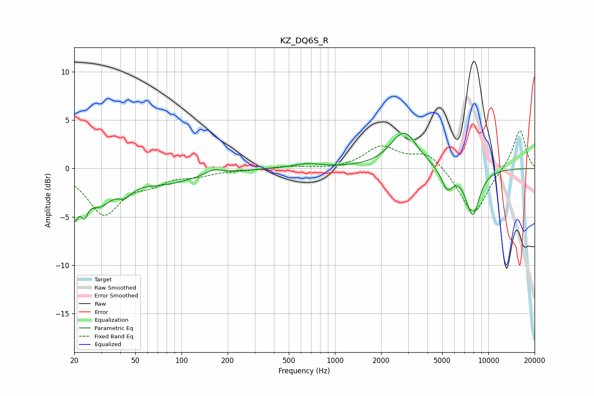

# KZ_DQ6S_R
See [usage instructions](https://github.com/jaakkopasanen/AutoEq#usage) for more options and info.

### Parametric EQs
Apply preamp of -3.7 dB when using parametric equalizer.

|   # | Type    |   Fc (Hz) |    Q |   Gain (dB) |
|-----|---------|-----------|------|-------------|
|   1 | Peaking |        20 | 5.81 |        -3.6 |
|   2 | Peaking |        23 | 5.81 |        -2.2 |
|   3 | Peaking |        29 | 1.72 |        -3   |
|   4 | Peaking |        43 | 3.23 |        -1.1 |
|   5 | Peaking |        75 | 0.68 |        -1.5 |
|   6 | Peaking |       162 | 2.97 |         0.5 |
|   7 | Peaking |       658 | 1.56 |         0.5 |
|   8 | Peaking |      2816 | 1.62 |         3.8 |
|   9 | Peaking |      5380 | 3.64 |        -2.1 |
|  10 | Peaking |      7903 | 2.85 |        -4.8 |

### Fixed Band EQs
When using fixed band (also called graphic) equalizer, apply preamp of **-4.0 dB** (if available) and set gains manually with these parameters.

|   # | Type    |   Fc (Hz) |    Q |   Gain (dB) |
|-----|---------|-----------|------|-------------|
|   1 | Peaking |        31 | 1.41 |        -4.6 |
|   2 | Peaking |        62 | 1.41 |        -1.2 |
|   3 | Peaking |       125 | 1.41 |        -0.6 |
|   4 | Peaking |       250 | 1.41 |        -0.1 |
|   5 | Peaking |       500 | 1.41 |         0.2 |
|   6 | Peaking |      1000 | 1.41 |        -0.1 |
|   7 | Peaking |      2000 | 1.41 |         2.2 |
|   8 | Peaking |      4000 | 1.41 |         1.6 |
|   9 | Peaking |      8000 | 1.41 |        -4.9 |
|  10 | Peaking |     16000 | 1.41 |         4.1 |

### Graphs

