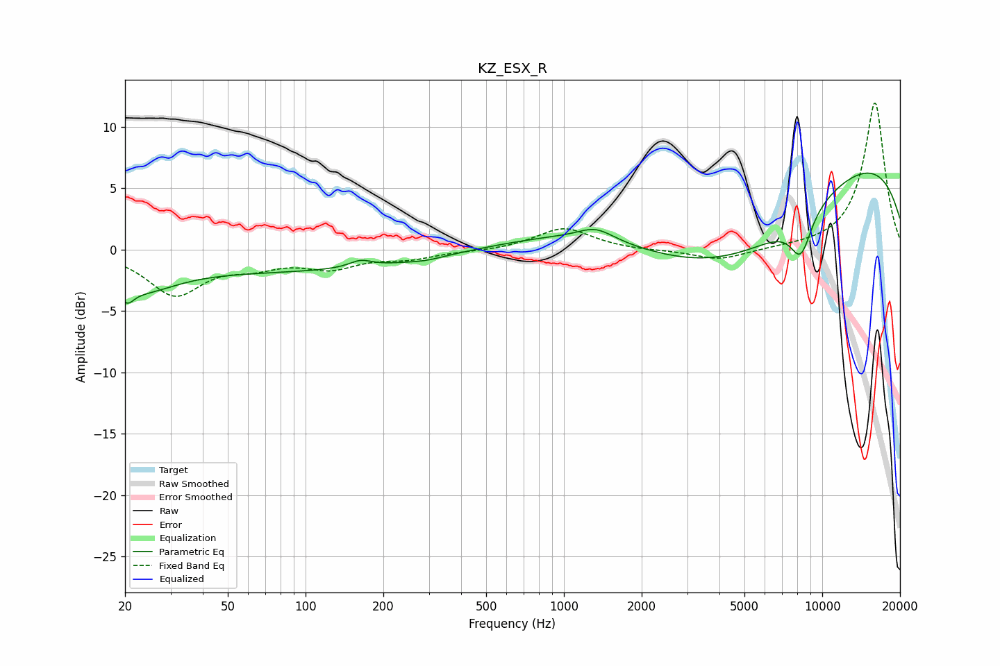

# KZ_ESX_R
See [usage instructions](https://github.com/jaakkopasanen/AutoEq#usage) for more options and info.

### Parametric EQs
Apply preamp of -6.3 dB when using parametric equalizer.

|   # | Type    |   Fc (Hz) |    Q |   Gain (dB) |
|-----|---------|-----------|------|-------------|
|   1 | Peaking |        20 | 5.15 |        -1.3 |
|   2 | Peaking |        23 | 1.05 |        -2.2 |
|   3 | Peaking |        82 | 0.24 |        -1.7 |
|   4 | Peaking |       163 | 3.28 |         0.6 |
|   5 | Peaking |       293 | 2.23 |        -0.2 |
|   6 | Peaking |      1328 | 2.05 |         1   |
|   7 | Peaking |      3191 | 0.39 |        -5.9 |
|   8 | Peaking |      6083 | 0.34 |        -8.9 |
|   9 | Peaking |      7053 | 0.18 |        14.3 |
|  10 | Peaking |      8264 | 3.15 |        -3.3 |

### Fixed Band EQs
When using fixed band (also called graphic) equalizer, apply preamp of **-12.0 dB** (if available) and set gains manually with these parameters.

|   # | Type    |   Fc (Hz) |    Q |   Gain (dB) |
|-----|---------|-----------|------|-------------|
|   1 | Peaking |        31 | 1.41 |        -3.6 |
|   2 | Peaking |        62 | 1.41 |        -1   |
|   3 | Peaking |       125 | 1.41 |        -1.3 |
|   4 | Peaking |       250 | 1.41 |        -0.6 |
|   5 | Peaking |       500 | 1.41 |        -0.1 |
|   6 | Peaking |      1000 | 1.41 |         1.8 |
|   7 | Peaking |      2000 | 1.41 |        -0.1 |
|   8 | Peaking |      4000 | 1.41 |        -0.9 |
|   9 | Peaking |      8000 | 1.41 |         0.1 |
|  10 | Peaking |     16000 | 1.41 |        12   |

### Graphs

