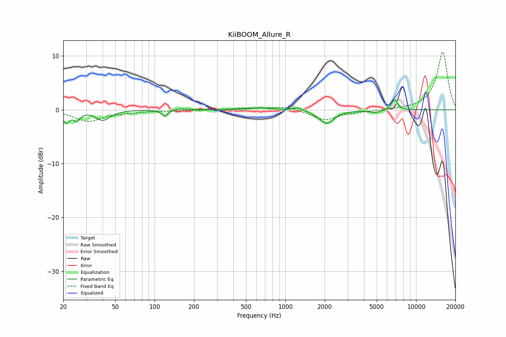

# KiiBOOM_Allure_R
See [usage instructions](https://github.com/jaakkopasanen/AutoEq#usage) for more options and info.

### Parametric EQs
Apply preamp of -1.9 dB when using parametric equalizer.

|   # | Type    |   Fc (Hz) |    Q |   Gain (dB) |
|-----|---------|-----------|------|-------------|
|   1 | Peaking |        21 | 5.82 |        -2.2 |
|   2 | Peaking |        25 | 5.73 |        -1.6 |
|   3 | Peaking |        40 | 2.64 |        -1.9 |
|   4 | Peaking |       120 | 5.96 |        -1.2 |
|   5 | Peaking |       155 | 2.78 |         0.3 |
|   6 | Peaking |       642 | 1.85 |         0.4 |
|   7 | Peaking |      1238 | 3.84 |         0.6 |
|   8 | Peaking |      2065 | 2.54 |        -2.5 |
|   9 | Peaking |      4903 | 3.27 |        -0.5 |
|  10 | Peaking |      6843 | 5.89 |         2   |

### Fixed Band EQs
When using fixed band (also called graphic) equalizer, apply preamp of **-10.8 dB** (if available) and set gains manually with these parameters.

|   # | Type    |   Fc (Hz) |    Q |   Gain (dB) |
|-----|---------|-----------|------|-------------|
|   1 | Peaking |        31 | 1.41 |        -2.1 |
|   2 | Peaking |        62 | 1.41 |        -0.3 |
|   3 | Peaking |       125 | 1.41 |        -0.2 |
|   4 | Peaking |       250 | 1.41 |        -0   |
|   5 | Peaking |       500 | 1.41 |         0.3 |
|   6 | Peaking |      1000 | 1.41 |         0.7 |
|   7 | Peaking |      2000 | 1.41 |        -1.9 |
|   8 | Peaking |      4000 | 1.41 |        -0.2 |
|   9 | Peaking |      8000 | 1.41 |         0   |
|  10 | Peaking |     16000 | 1.41 |        10.8 |

### Graphs

