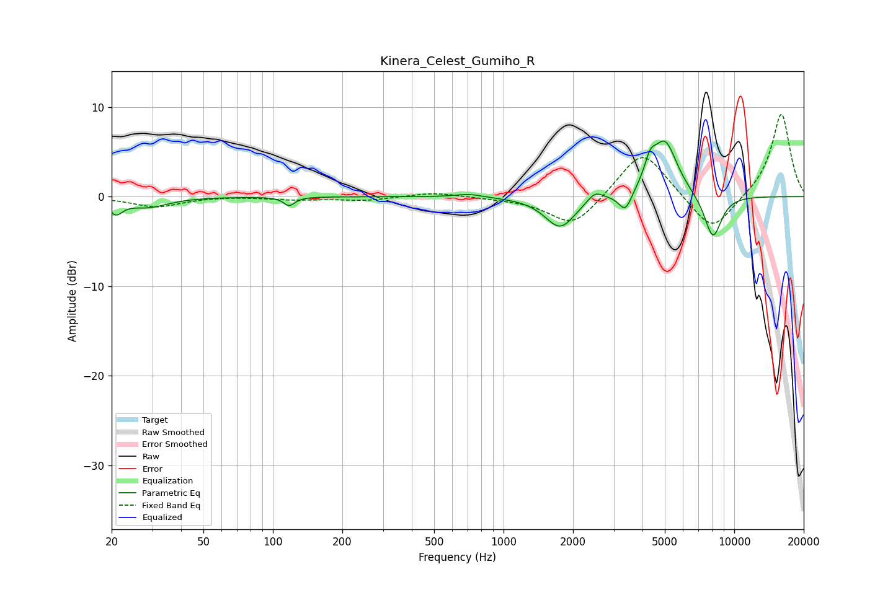

# Kinera_Celest_Gumiho_R
See [usage instructions](https://github.com/jaakkopasanen/AutoEq#usage) for more options and info.

### Parametric EQs
Apply preamp of -6.3 dB when using parametric equalizer.

|   # | Type    |   Fc (Hz) |    Q |   Gain (dB) |
|-----|---------|-----------|------|-------------|
|   1 | Peaking |        21 | 4.85 |        -1.5 |
|   2 | Peaking |        29 | 1.64 |        -1.1 |
|   3 | Peaking |       118 | 5.99 |        -1   |
|   4 | Peaking |       707 | 2.41 |         0.4 |
|   5 | Peaking |      1760 | 2.15 |        -3.5 |
|   6 | Peaking |      2491 | 4.22 |         1.1 |
|   7 | Peaking |      3374 | 4.9  |        -2.2 |
|   8 | Peaking |      4318 | 5.72 |         2.1 |
|   9 | Peaking |      5005 | 2.54 |         6.2 |
|  10 | Peaking |      8082 | 3.46 |        -4.9 |

### Fixed Band EQs
When using fixed band (also called graphic) equalizer, apply preamp of **-9.3 dB** (if available) and set gains manually with these parameters.

|   # | Type    |   Fc (Hz) |    Q |   Gain (dB) |
|-----|---------|-----------|------|-------------|
|   1 | Peaking |        31 | 1.41 |        -1.1 |
|   2 | Peaking |        62 | 1.41 |         0.1 |
|   3 | Peaking |       125 | 1.41 |        -0.3 |
|   4 | Peaking |       250 | 1.41 |        -0.4 |
|   5 | Peaking |       500 | 1.41 |         0.5 |
|   6 | Peaking |      1000 | 1.41 |        -0.1 |
|   7 | Peaking |      2000 | 1.41 |        -3.5 |
|   8 | Peaking |      4000 | 1.41 |         5.5 |
|   9 | Peaking |      8000 | 1.41 |        -4.2 |
|  10 | Peaking |     16000 | 1.41 |         9.4 |

### Graphs

