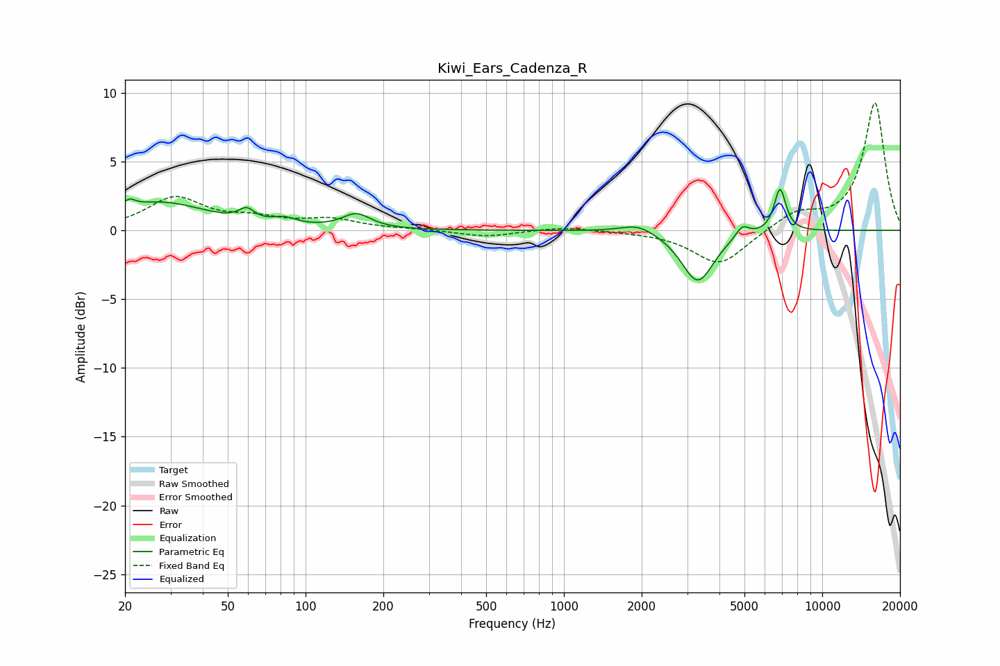

# Kiwi_Ears_Cadenza_R
See [usage instructions](https://github.com/jaakkopasanen/AutoEq#usage) for more options and info.

### Parametric EQs
Apply preamp of -3.1 dB when using parametric equalizer.

|   # | Type    |   Fc (Hz) |    Q |   Gain (dB) |
|-----|---------|-----------|------|-------------|
|   1 | Peaking |        21 | 6    |        -1.5 |
|   2 | Peaking |        21 | 5.98 |         2.2 |
|   3 | Peaking |        27 | 0.79 |         2   |
|   4 | Peaking |        59 | 4.79 |         0.8 |
|   5 | Peaking |        83 | 3.05 |         0.5 |
|   6 | Peaking |       157 | 2.57 |         1.1 |
|   7 | Peaking |      1933 | 2.14 |         0.7 |
|   8 | Peaking |      3296 | 2.26 |        -3.8 |
|   9 | Peaking |      4907 | 5.46 |         0.9 |
|  10 | Peaking |      6866 | 5.98 |         3.2 |

### Fixed Band EQs
When using fixed band (also called graphic) equalizer, apply preamp of **-9.3 dB** (if available) and set gains manually with these parameters.

|   # | Type    |   Fc (Hz) |    Q |   Gain (dB) |
|-----|---------|-----------|------|-------------|
|   1 | Peaking |        31 | 1.41 |         2.3 |
|   2 | Peaking |        62 | 1.41 |         0.7 |
|   3 | Peaking |       125 | 1.41 |         0.7 |
|   4 | Peaking |       250 | 1.41 |         0.1 |
|   5 | Peaking |       500 | 1.41 |        -0.5 |
|   6 | Peaking |      1000 | 1.41 |         0.3 |
|   7 | Peaking |      2000 | 1.41 |        -0.1 |
|   8 | Peaking |      4000 | 1.41 |        -2.6 |
|   9 | Peaking |      8000 | 1.41 |         1.2 |
|  10 | Peaking |     16000 | 1.41 |         9.3 |

### Graphs

