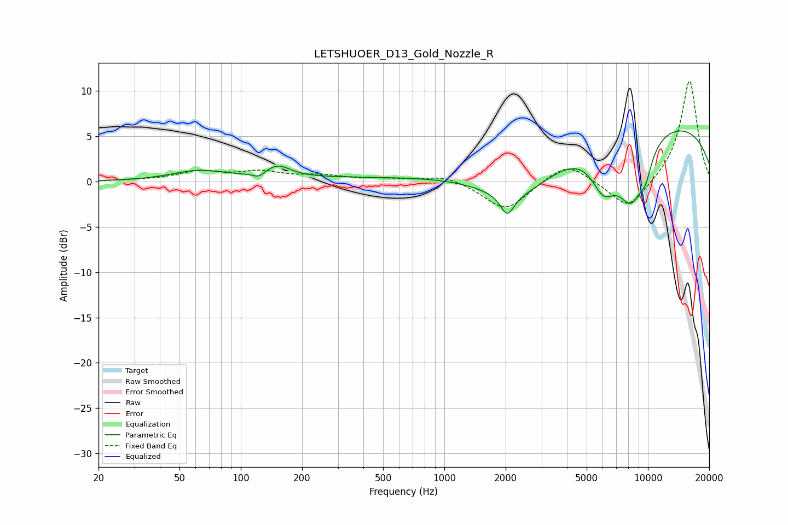

# LETSHUOER_D13_Gold_Nozzle_R
See [usage instructions](https://github.com/jaakkopasanen/AutoEq#usage) for more options and info.

### Parametric EQs
Apply preamp of -5.7 dB when using parametric equalizer.

|   # | Type    |   Fc (Hz) |    Q |   Gain (dB) |
|-----|---------|-----------|------|-------------|
|   1 | Peaking |        62 | 1.09 |         1.1 |
|   2 | Peaking |       122 | 5.15 |        -0.6 |
|   3 | Peaking |       152 | 2.3  |         1.3 |
|   4 | Peaking |       593 | 0.18 |         0.5 |
|   5 | Peaking |      2039 | 4.38 |        -2.3 |
|   6 | Peaking |      2370 | 0.69 |        -5.5 |
|   7 | Peaking |      6061 | 2.18 |        -4.4 |
|   8 | Peaking |      8280 | 1.8  |        -7.1 |
|   9 | Peaking |      9010 | 0.18 |         7.1 |
|  10 | Peaking |      9749 | 4.05 |        -2.1 |

### Fixed Band EQs
When using fixed band (also called graphic) equalizer, apply preamp of **-11.2 dB** (if available) and set gains manually with these parameters.

|   # | Type    |   Fc (Hz) |    Q |   Gain (dB) |
|-----|---------|-----------|------|-------------|
|   1 | Peaking |        31 | 1.41 |         0.1 |
|   2 | Peaking |        62 | 1.41 |         1   |
|   3 | Peaking |       125 | 1.41 |         1   |
|   4 | Peaking |       250 | 1.41 |         0.6 |
|   5 | Peaking |       500 | 1.41 |         0.2 |
|   6 | Peaking |      1000 | 1.41 |         0.8 |
|   7 | Peaking |      2000 | 1.41 |        -3.3 |
|   8 | Peaking |      4000 | 1.41 |         2.2 |
|   9 | Peaking |      8000 | 1.41 |        -3.3 |
|  10 | Peaking |     16000 | 1.41 |        11.3 |

### Graphs

