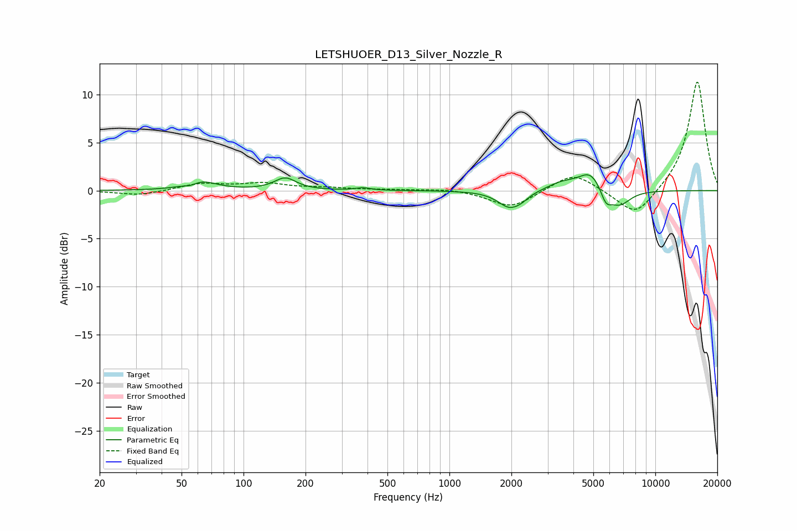

# LETSHUOER_D13_Silver_Nozzle_R
See [usage instructions](https://github.com/jaakkopasanen/AutoEq#usage) for more options and info.

### Parametric EQs
Apply preamp of -1.7 dB when using parametric equalizer.

|   # | Type    |   Fc (Hz) |    Q |   Gain (dB) |
|-----|---------|-----------|------|-------------|
|   1 | Peaking |        55 | 5.25 |        -0.3 |
|   2 | Peaking |        62 | 1.89 |         0.9 |
|   3 | Peaking |       159 | 2.7  |         1.3 |
|   4 | Peaking |       380 | 4.11 |         0.3 |
|   5 | Peaking |      1958 | 2.49 |        -1.7 |
|   6 | Peaking |      2239 | 3.91 |        -0.4 |
|   7 | Peaking |      3498 | 2    |         0.7 |
|   8 | Peaking |      4857 | 2.31 |         2.1 |
|   9 | Peaking |      5758 | 4.96 |        -1.6 |
|  10 | Peaking |      6693 | 2.53 |        -1.7 |

### Fixed Band EQs
When using fixed band (also called graphic) equalizer, apply preamp of **-11.4 dB** (if available) and set gains manually with these parameters.

|   # | Type    |   Fc (Hz) |    Q |   Gain (dB) |
|-----|---------|-----------|------|-------------|
|   1 | Peaking |        31 | 1.41 |        -0.5 |
|   2 | Peaking |        62 | 1.41 |         0.7 |
|   3 | Peaking |       125 | 1.41 |         0.7 |
|   4 | Peaking |       250 | 1.41 |         0.2 |
|   5 | Peaking |       500 | 1.41 |         0.1 |
|   6 | Peaking |      1000 | 1.41 |         0.2 |
|   7 | Peaking |      2000 | 1.41 |        -1.8 |
|   8 | Peaking |      4000 | 1.41 |         1.9 |
|   9 | Peaking |      8000 | 1.41 |        -2.9 |
|  10 | Peaking |     16000 | 1.41 |        11.5 |

### Graphs

