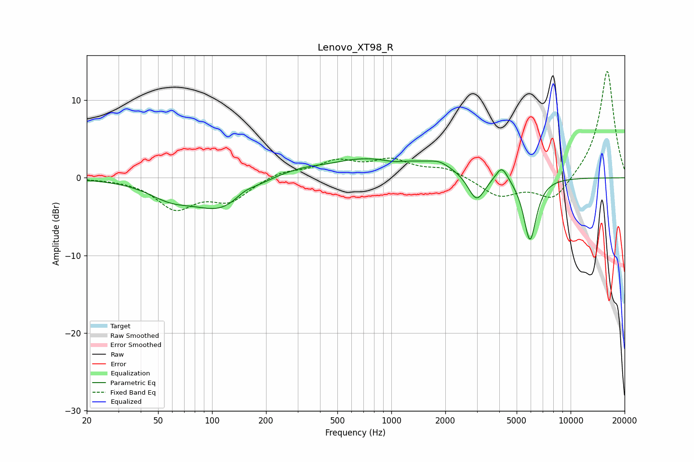

# Lenovo_XT98_R
See [usage instructions](https://github.com/jaakkopasanen/AutoEq#usage) for more options and info.

### Parametric EQs
Apply preamp of -2.5 dB when using parametric equalizer.

|   # | Type    |   Fc (Hz) |    Q |   Gain (dB) |
|-----|---------|-----------|------|-------------|
|   1 | Peaking |        59 | 1.12 |        -2   |
|   2 | Peaking |       113 | 0.92 |        -3.9 |
|   3 | Peaking |       151 | 2.83 |         0.6 |
|   4 | Peaking |       448 | 1.58 |        -0.3 |
|   5 | Peaking |       731 | 0.31 |         2.8 |
|   6 | Peaking |      1029 | 2.22 |        -0.5 |
|   7 | Peaking |      1847 | 2.73 |         0.6 |
|   8 | Peaking |      2986 | 2.9  |        -3.7 |
|   9 | Peaking |      4133 | 4.23 |         1.9 |
|  10 | Peaking |      5933 | 3.84 |        -8.3 |

### Fixed Band EQs
When using fixed band (also called graphic) equalizer, apply preamp of **-13.8 dB** (if available) and set gains manually with these parameters.

|   # | Type    |   Fc (Hz) |    Q |   Gain (dB) |
|-----|---------|-----------|------|-------------|
|   1 | Peaking |        31 | 1.41 |        -0.1 |
|   2 | Peaking |        62 | 1.41 |        -3.8 |
|   3 | Peaking |       125 | 1.41 |        -2.8 |
|   4 | Peaking |       250 | 1.41 |         0.9 |
|   5 | Peaking |       500 | 1.41 |         2   |
|   6 | Peaking |      1000 | 1.41 |         2   |
|   7 | Peaking |      2000 | 1.41 |         1.2 |
|   8 | Peaking |      4000 | 1.41 |        -2.4 |
|   9 | Peaking |      8000 | 1.41 |        -3.1 |
|  10 | Peaking |     16000 | 1.41 |        14   |

### Graphs

