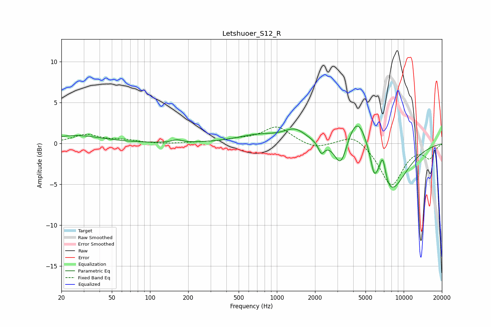

# Letshuoer_S12_R
See [usage instructions](https://github.com/jaakkopasanen/AutoEq#usage) for more options and info.

### Parametric EQs
Apply preamp of -2.2 dB when using parametric equalizer.

|   # | Type    |   Fc (Hz) |    Q |   Gain (dB) |
|-----|---------|-----------|------|-------------|
|   1 | Peaking |        26 | 0.69 |         1   |
|   2 | Peaking |       163 | 3.94 |         0.3 |
|   3 | Peaking |       711 | 0.83 |         1   |
|   4 | Peaking |      1390 | 1.63 |         1.5 |
|   5 | Peaking |      2243 | 5.84 |        -1.4 |
|   6 | Peaking |      3195 | 2.84 |        -3.6 |
|   7 | Peaking |      4379 | 1.51 |         5.7 |
|   8 | Peaking |      5829 | 5.98 |        -1.7 |
|   9 | Peaking |      6836 | 5.28 |         3.5 |
|  10 | Peaking |      7428 | 0.96 |        -7.1 |

### Fixed Band EQs
When using fixed band (also called graphic) equalizer, apply preamp of **-2.1 dB** (if available) and set gains manually with these parameters.

|   # | Type    |   Fc (Hz) |    Q |   Gain (dB) |
|-----|---------|-----------|------|-------------|
|   1 | Peaking |        31 | 1.41 |         1.1 |
|   2 | Peaking |        62 | 1.41 |         0.4 |
|   3 | Peaking |       125 | 1.41 |        -0.1 |
|   4 | Peaking |       250 | 1.41 |         0.1 |
|   5 | Peaking |       500 | 1.41 |         0.4 |
|   6 | Peaking |      1000 | 1.41 |         2.1 |
|   7 | Peaking |      2000 | 1.41 |        -0.7 |
|   8 | Peaking |      4000 | 1.41 |         1.3 |
|   9 | Peaking |      8000 | 1.41 |        -5.1 |
|  10 | Peaking |     16000 | 1.41 |        -1.7 |

### Graphs

