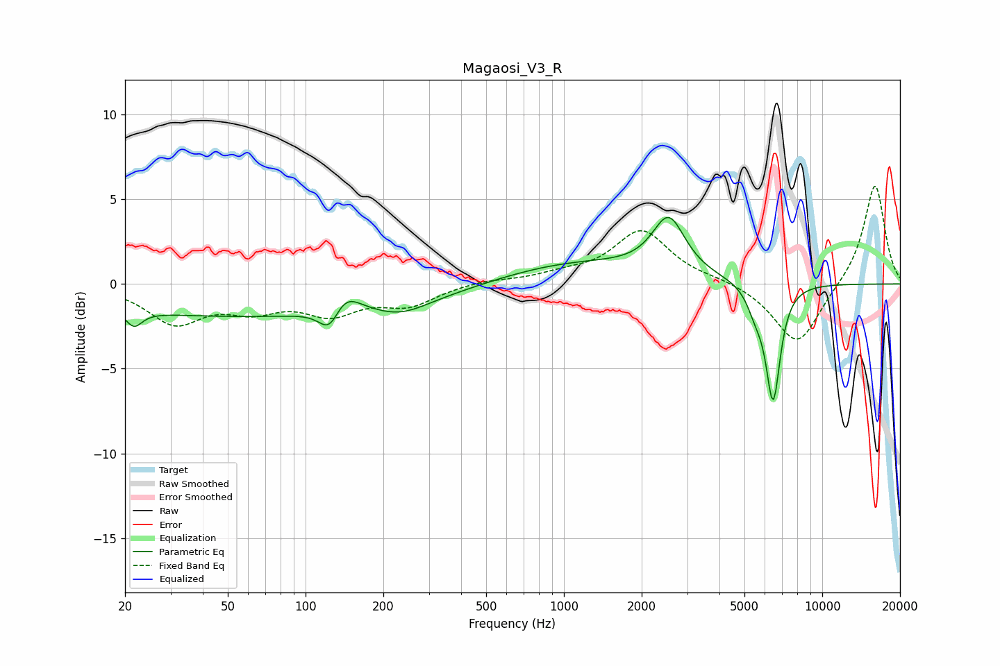

# Magaosi_V3_R
See [usage instructions](https://github.com/jaakkopasanen/AutoEq#usage) for more options and info.

### Parametric EQs
Apply preamp of -4.0 dB when using parametric equalizer.

|   # | Type    |   Fc (Hz) |    Q |   Gain (dB) |
|-----|---------|-----------|------|-------------|
|   1 | Peaking |        22 | 4.54 |        -1   |
|   2 | Peaking |        66 | 0.18 |        -1.9 |
|   3 | Peaking |       124 | 3.27 |        -1.9 |
|   4 | Peaking |       138 | 2.26 |         1.8 |
|   5 | Peaking |       237 | 1.43 |        -0.6 |
|   6 | Peaking |      1108 | 0.46 |         1.3 |
|   7 | Peaking |      2549 | 2.28 |         3.8 |
|   8 | Peaking |      2566 | 2.39 |        -0.5 |
|   9 | Peaking |      5521 | 4.23 |        -1.2 |
|  10 | Peaking |      6455 | 4.86 |        -6.8 |

### Fixed Band EQs
When using fixed band (also called graphic) equalizer, apply preamp of **-5.9 dB** (if available) and set gains manually with these parameters.

|   # | Type    |   Fc (Hz) |    Q |   Gain (dB) |
|-----|---------|-----------|------|-------------|
|   1 | Peaking |        31 | 1.41 |        -2.2 |
|   2 | Peaking |        62 | 1.41 |        -1.2 |
|   3 | Peaking |       125 | 1.41 |        -1.6 |
|   4 | Peaking |       250 | 1.41 |        -1.1 |
|   5 | Peaking |       500 | 1.41 |         0.2 |
|   6 | Peaking |      1000 | 1.41 |         0.4 |
|   7 | Peaking |      2000 | 1.41 |         3.1 |
|   8 | Peaking |      4000 | 1.41 |         0.2 |
|   9 | Peaking |      8000 | 1.41 |        -3.7 |
|  10 | Peaking |     16000 | 1.41 |         6   |

### Graphs

