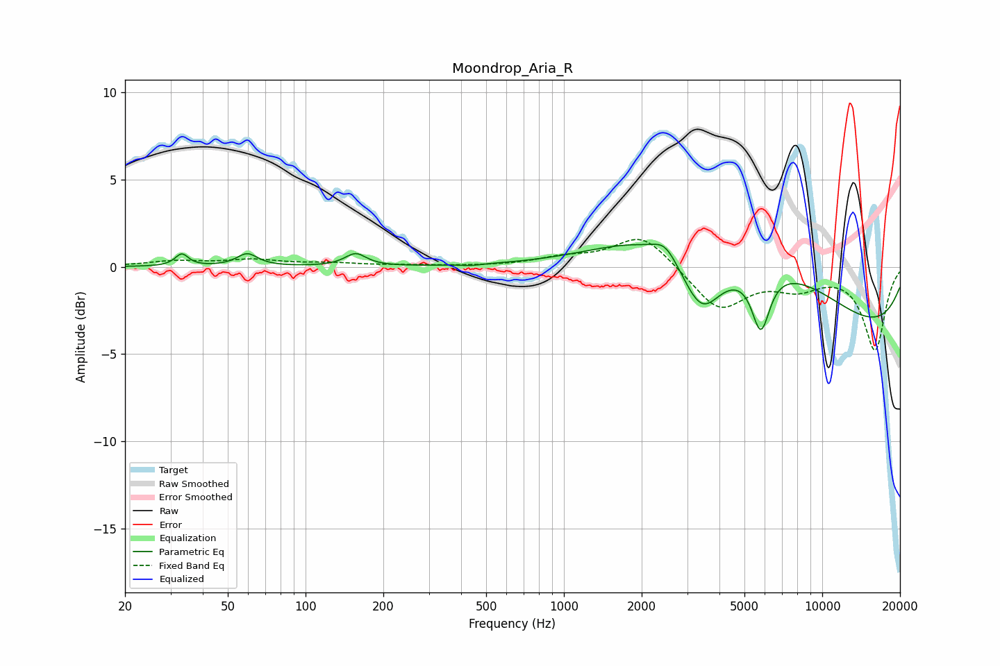

# Moondrop_Aria_R
See [usage instructions](https://github.com/jaakkopasanen/AutoEq#usage) for more options and info.

### Parametric EQs
Apply preamp of -1.4 dB when using parametric equalizer.

|   # | Type    |   Fc (Hz) |    Q |   Gain (dB) |
|-----|---------|-----------|------|-------------|
|   1 | Peaking |        33 | 5.79 |         0.7 |
|   2 | Peaking |        59 | 3.58 |         0.7 |
|   3 | Peaking |       156 | 3.49 |         0.7 |
|   4 | Peaking |       437 | 4.06 |        -0.1 |
|   5 | Peaking |      2199 | 0.61 |         2.5 |
|   6 | Peaking |      2467 | 3.1  |         0.9 |
|   7 | Peaking |      3402 | 1.9  |        -3   |
|   8 | Peaking |      5784 | 3.98 |        -3.3 |
|   9 | Peaking |      6797 | 0.5  |         3.6 |
|  10 | Peaking |      9884 | 0.2  |        -4.4 |

### Fixed Band EQs
When using fixed band (also called graphic) equalizer, apply preamp of **-1.7 dB** (if available) and set gains manually with these parameters.

|   # | Type    |   Fc (Hz) |    Q |   Gain (dB) |
|-----|---------|-----------|------|-------------|
|   1 | Peaking |        31 | 1.41 |         0.3 |
|   2 | Peaking |        62 | 1.41 |         0.4 |
|   3 | Peaking |       125 | 1.41 |         0.2 |
|   4 | Peaking |       250 | 1.41 |         0.1 |
|   5 | Peaking |       500 | 1.41 |         0   |
|   6 | Peaking |      1000 | 1.41 |         0.4 |
|   7 | Peaking |      2000 | 1.41 |         1.9 |
|   8 | Peaking |      4000 | 1.41 |        -2.5 |
|   9 | Peaking |      8000 | 1.41 |        -1   |
|  10 | Peaking |     16000 | 1.41 |        -4.7 |

### Graphs

