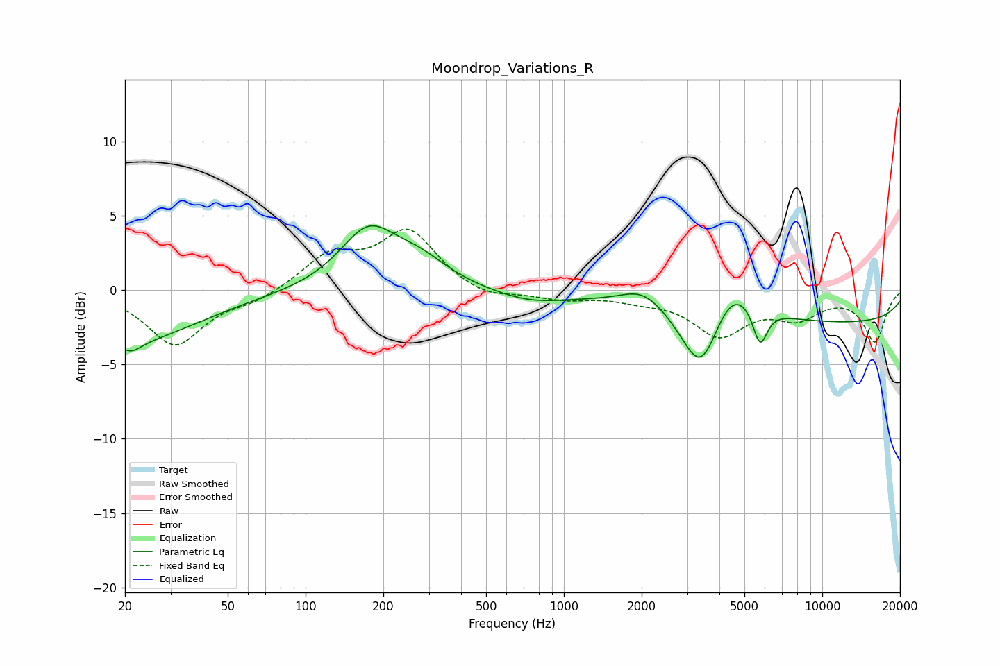

# Moondrop_Variations_R
See [usage instructions](https://github.com/jaakkopasanen/AutoEq#usage) for more options and info.

### Parametric EQs
Apply preamp of -4.4 dB when using parametric equalizer.

|   # | Type    |   Fc (Hz) |    Q |   Gain (dB) |
|-----|---------|-----------|------|-------------|
|   1 | Peaking |        20 | 0.51 |        -3.5 |
|   2 | Peaking |        21 | 3.64 |        -0.7 |
|   3 | Peaking |       175 | 1.29 |         3.9 |
|   4 | Peaking |       277 | 1.25 |         1.5 |
|   5 | Peaking |       739 | 0.99 |        -0.8 |
|   6 | Peaking |      2027 | 1.66 |         1.3 |
|   7 | Peaking |      3411 | 1.83 |        -5.3 |
|   8 | Peaking |      4380 | 1.34 |         3.6 |
|   9 | Peaking |      5745 | 4.83 |        -2.7 |
|  10 | Peaking |     10000 | 0.18 |        -2.2 |

### Fixed Band EQs
When using fixed band (also called graphic) equalizer, apply preamp of **-4.2 dB** (if available) and set gains manually with these parameters.

|   # | Type    |   Fc (Hz) |    Q |   Gain (dB) |
|-----|---------|-----------|------|-------------|
|   1 | Peaking |        31 | 1.41 |        -3.7 |
|   2 | Peaking |        62 | 1.41 |        -0.7 |
|   3 | Peaking |       125 | 1.41 |         2.2 |
|   4 | Peaking |       250 | 1.41 |         3.9 |
|   5 | Peaking |       500 | 1.41 |        -0.7 |
|   6 | Peaking |      1000 | 1.41 |        -0.6 |
|   7 | Peaking |      2000 | 1.41 |        -0.5 |
|   8 | Peaking |      4000 | 1.41 |        -2.9 |
|   9 | Peaking |      8000 | 1.41 |        -1.6 |
|  10 | Peaking |     16000 | 1.41 |        -3.4 |

### Graphs

