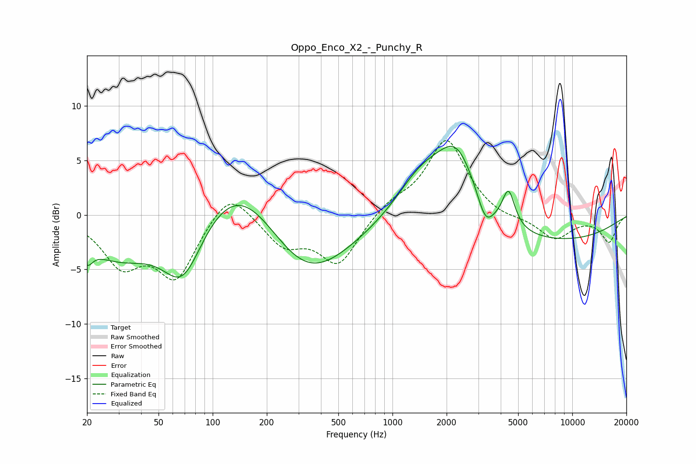

# Oppo_Enco_X2_-_Punchy_R
See [usage instructions](https://github.com/jaakkopasanen/AutoEq#usage) for more options and info.

### Parametric EQs
Apply preamp of -6.4 dB when using parametric equalizer.

|   # | Type    |   Fc (Hz) |    Q |   Gain (dB) |
|-----|---------|-----------|------|-------------|
|   1 | Peaking |        20 | 4.77 |        -1.6 |
|   2 | Peaking |        30 | 0.69 |        -3.7 |
|   3 | Peaking |        68 | 1.24 |        -6   |
|   4 | Peaking |       143 | 0.61 |         5.5 |
|   5 | Peaking |       327 | 0.57 |        -6.6 |
|   6 | Peaking |      1448 | 0.97 |         4.1 |
|   7 | Peaking |      2289 | 1.22 |         6.5 |
|   8 | Peaking |      3287 | 3.18 |        -2.3 |
|   9 | Peaking |      4421 | 4.11 |         3.3 |
|  10 | Peaking |      5790 | 0.25 |        -2.7 |

### Fixed Band EQs
When using fixed band (also called graphic) equalizer, apply preamp of **-6.9 dB** (if available) and set gains manually with these parameters.

|   # | Type    |   Fc (Hz) |    Q |   Gain (dB) |
|-----|---------|-----------|------|-------------|
|   1 | Peaking |        31 | 1.41 |        -4.2 |
|   2 | Peaking |        62 | 1.41 |        -5.5 |
|   3 | Peaking |       125 | 1.41 |         2.8 |
|   4 | Peaking |       250 | 1.41 |        -2.6 |
|   5 | Peaking |       500 | 1.41 |        -4.4 |
|   6 | Peaking |      1000 | 1.41 |         1.1 |
|   7 | Peaking |      2000 | 1.41 |         6.9 |
|   8 | Peaking |      4000 | 1.41 |        -0.5 |
|   9 | Peaking |      8000 | 1.41 |        -2.2 |
|  10 | Peaking |     16000 | 1.41 |        -2.4 |

### Graphs

