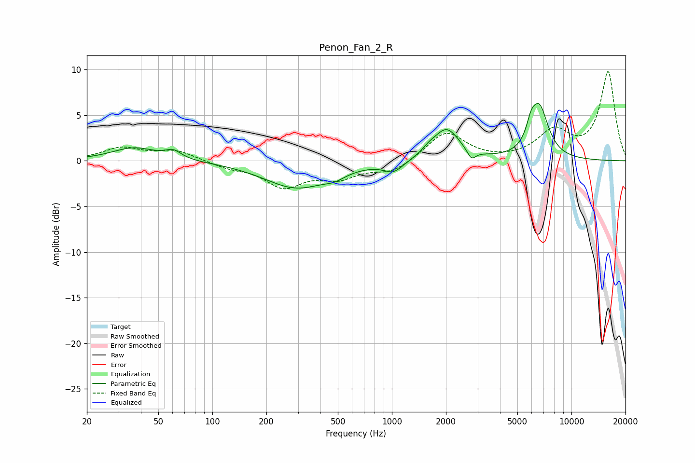

# Penon_Fan_2_R
See [usage instructions](https://github.com/jaakkopasanen/AutoEq#usage) for more options and info.

### Parametric EQs
Apply preamp of -6.4 dB when using parametric equalizer.

|   # | Type    |   Fc (Hz) |    Q |   Gain (dB) |
|-----|---------|-----------|------|-------------|
|   1 | Peaking |        37 | 1.15 |         1.4 |
|   2 | Peaking |        61 | 3.22 |         0.9 |
|   3 | Peaking |       294 | 0.78 |        -2.9 |
|   4 | Peaking |       480 | 2.54 |        -0.6 |
|   5 | Peaking |      1022 | 2.66 |        -1.2 |
|   6 | Peaking |      1606 | 3.63 |         0.5 |
|   7 | Peaking |      2014 | 1.95 |         3.4 |
|   8 | Peaking |      2774 | 5.99 |        -1.1 |
|   9 | Peaking |      5947 | 5.93 |         1.4 |
|  10 | Peaking |      6606 | 2.7  |         5.7 |

### Fixed Band EQs
When using fixed band (also called graphic) equalizer, apply preamp of **-9.9 dB** (if available) and set gains manually with these parameters.

|   # | Type    |   Fc (Hz) |    Q |   Gain (dB) |
|-----|---------|-----------|------|-------------|
|   1 | Peaking |        31 | 1.41 |         1.4 |
|   2 | Peaking |        62 | 1.41 |         1.1 |
|   3 | Peaking |       125 | 1.41 |        -0.6 |
|   4 | Peaking |       250 | 1.41 |        -2.7 |
|   5 | Peaking |       500 | 1.41 |        -1.6 |
|   6 | Peaking |      1000 | 1.41 |        -1.2 |
|   7 | Peaking |      2000 | 1.41 |         3.2 |
|   8 | Peaking |      4000 | 1.41 |        -0.1 |
|   9 | Peaking |      8000 | 1.41 |         3.1 |
|  10 | Peaking |     16000 | 1.41 |         9.7 |

### Graphs

