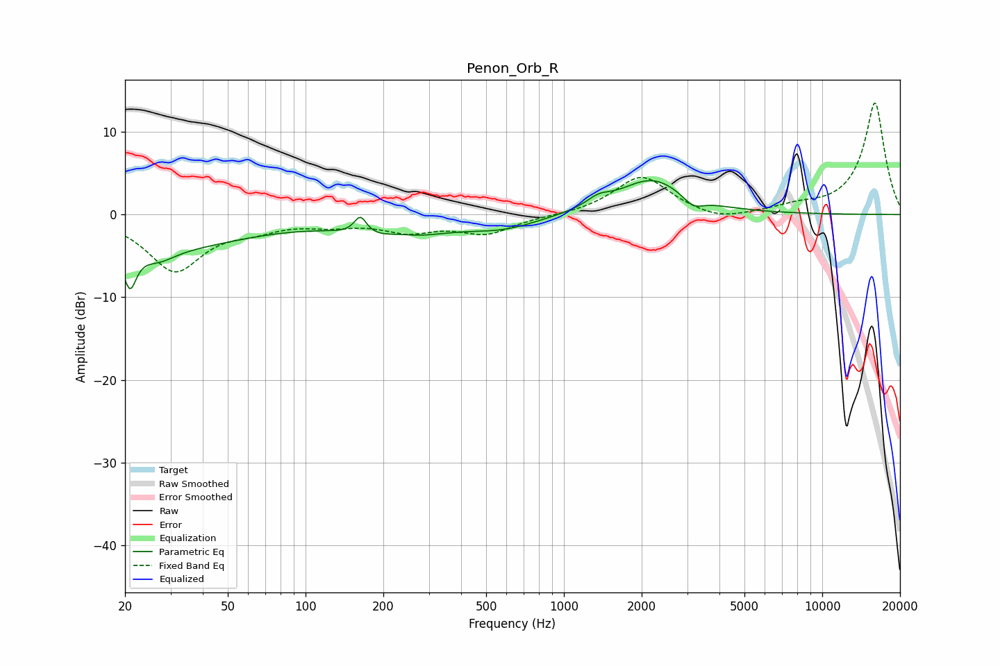

# Penon_Orb_R
See [usage instructions](https://github.com/jaakkopasanen/AutoEq#usage) for more options and info.

### Parametric EQs
Apply preamp of -4.2 dB when using parametric equalizer.

|   # | Type    |   Fc (Hz) |    Q |   Gain (dB) |
|-----|---------|-----------|------|-------------|
|   1 | Peaking |        21 | 5.86 |        -4.6 |
|   2 | Peaking |        26 | 0.41 |        -4   |
|   3 | Peaking |        27 | 2.34 |        -1.3 |
|   4 | Peaking |       163 | 5.99 |         2.1 |
|   5 | Peaking |       227 | 0.86 |        -2.8 |
|   6 | Peaking |       229 | 1.99 |         0.8 |
|   7 | Peaking |       583 | 0.99 |        -1.5 |
|   8 | Peaking |      1359 | 3.11 |         1   |
|   9 | Peaking |      2196 | 1.1  |         4.3 |
|  10 | Peaking |      3162 | 3.5  |        -1.3 |

### Fixed Band EQs
When using fixed band (also called graphic) equalizer, apply preamp of **-13.6 dB** (if available) and set gains manually with these parameters.

|   # | Type    |   Fc (Hz) |    Q |   Gain (dB) |
|-----|---------|-----------|------|-------------|
|   1 | Peaking |        31 | 1.41 |        -6.6 |
|   2 | Peaking |        62 | 1.41 |        -1.3 |
|   3 | Peaking |       125 | 1.41 |        -0.9 |
|   4 | Peaking |       250 | 1.41 |        -1.8 |
|   5 | Peaking |       500 | 1.41 |        -2.2 |
|   6 | Peaking |      1000 | 1.41 |        -0.1 |
|   7 | Peaking |      2000 | 1.41 |         4.7 |
|   8 | Peaking |      4000 | 1.41 |        -1   |
|   9 | Peaking |      8000 | 1.41 |         0.8 |
|  10 | Peaking |     16000 | 1.41 |        13.5 |

### Graphs

