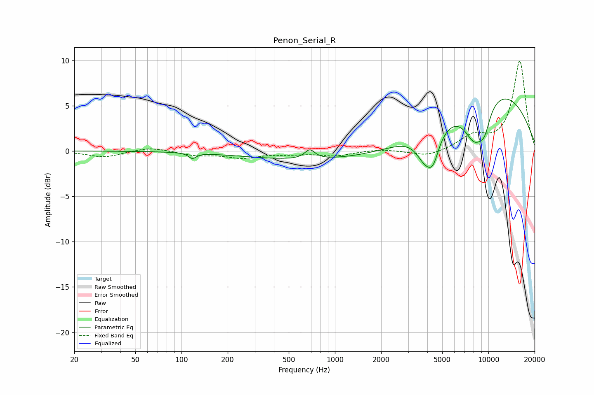

# Penon_Serial_R
See [usage instructions](https://github.com/jaakkopasanen/AutoEq#usage) for more options and info.

### Parametric EQs
Apply preamp of -5.8 dB when using parametric equalizer.

|   # | Type    |   Fc (Hz) |    Q |   Gain (dB) |
|-----|---------|-----------|------|-------------|
|   1 | Peaking |       118 | 5.96 |        -0.6 |
|   2 | Peaking |       685 | 4.33 |         1   |
|   3 | Peaking |      1359 | 0.18 |        -1.2 |
|   4 | Peaking |      3779 | 3.63 |        -0   |
|   5 | Peaking |      3793 | 2.56 |        -2.1 |
|   6 | Peaking |      4349 | 3.09 |        -3.3 |
|   7 | Peaking |      4788 | 5.27 |         0.1 |
|   8 | Peaking |      8169 | 1.8  |        -4.6 |
|   9 | Peaking |      9455 | 3.46 |        -2   |
|  10 | Peaking |     10000 | 0.33 |         7.2 |

### Fixed Band EQs
When using fixed band (also called graphic) equalizer, apply preamp of **-10.0 dB** (if available) and set gains manually with these parameters.

|   # | Type    |   Fc (Hz) |    Q |   Gain (dB) |
|-----|---------|-----------|------|-------------|
|   1 | Peaking |        31 | 1.41 |        -0.7 |
|   2 | Peaking |        62 | 1.41 |         0.5 |
|   3 | Peaking |       125 | 1.41 |        -0.4 |
|   4 | Peaking |       250 | 1.41 |        -0.7 |
|   5 | Peaking |       500 | 1.41 |        -0.3 |
|   6 | Peaking |      1000 | 1.41 |        -0.5 |
|   7 | Peaking |      2000 | 1.41 |         0.2 |
|   8 | Peaking |      4000 | 1.41 |        -0.7 |
|   9 | Peaking |      8000 | 1.41 |         1.5 |
|  10 | Peaking |     16000 | 1.41 |         9.9 |

### Graphs

