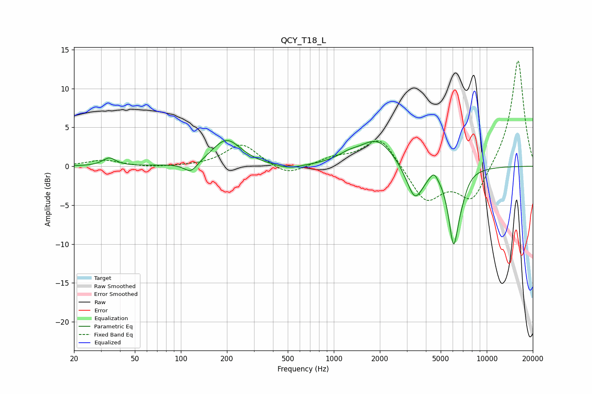

# QCY_T18_L
See [usage instructions](https://github.com/jaakkopasanen/AutoEq#usage) for more options and info.

### Parametric EQs
Apply preamp of -3.4 dB when using parametric equalizer.

|   # | Type    |   Fc (Hz) |    Q |   Gain (dB) |
|-----|---------|-----------|------|-------------|
|   1 | Peaking |        34 | 3.38 |         1   |
|   2 | Peaking |       116 | 3.18 |        -1.4 |
|   3 | Peaking |       199 | 1.5  |         3.4 |
|   4 | Peaking |       506 | 1.68 |        -0.6 |
|   5 | Peaking |      1246 | 1.93 |         0.8 |
|   6 | Peaking |      1923 | 1.27 |         3.4 |
|   7 | Peaking |      3386 | 2.56 |        -4.5 |
|   8 | Peaking |      4511 | 5.23 |         1.1 |
|   9 | Peaking |      6074 | 4.01 |        -9.5 |
|  10 | Peaking |      6912 | 4.2  |        -1.2 |

### Fixed Band EQs
When using fixed band (also called graphic) equalizer, apply preamp of **-13.7 dB** (if available) and set gains manually with these parameters.

|   # | Type    |   Fc (Hz) |    Q |   Gain (dB) |
|-----|---------|-----------|------|-------------|
|   1 | Peaking |        31 | 1.41 |         0.8 |
|   2 | Peaking |        62 | 1.41 |        -0.2 |
|   3 | Peaking |       125 | 1.41 |        -0   |
|   4 | Peaking |       250 | 1.41 |         2.9 |
|   5 | Peaking |       500 | 1.41 |        -1.4 |
|   6 | Peaking |      1000 | 1.41 |         0.9 |
|   7 | Peaking |      2000 | 1.41 |         3.9 |
|   8 | Peaking |      4000 | 1.41 |        -4.6 |
|   9 | Peaking |      8000 | 1.41 |        -4.5 |
|  10 | Peaking |     16000 | 1.41 |        13.9 |

### Graphs

