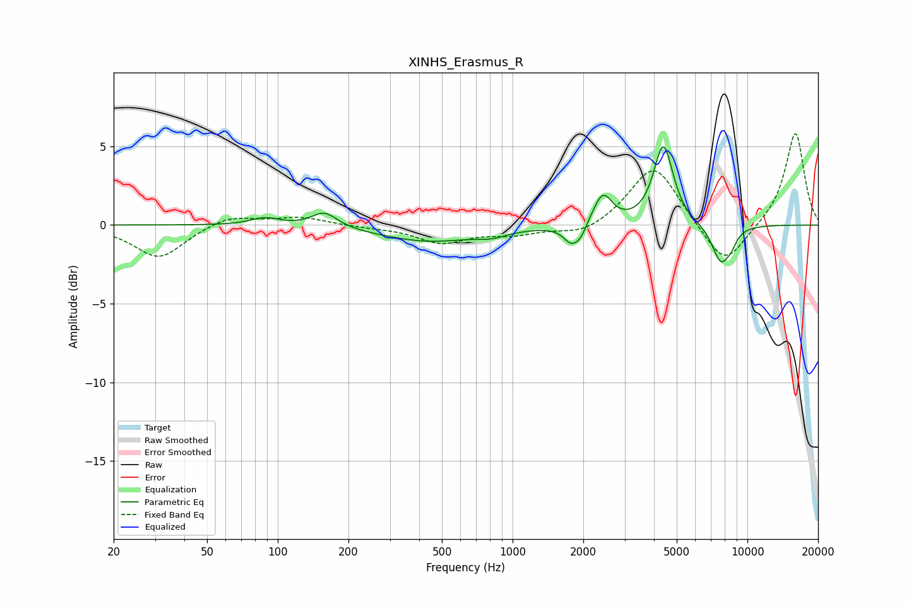

# XINHS_Erasmus_R
See [usage instructions](https://github.com/jaakkopasanen/AutoEq#usage) for more options and info.

### Parametric EQs
Apply preamp of -5.1 dB when using parametric equalizer.

|   # | Type    |   Fc (Hz) |    Q |   Gain (dB) |
|-----|---------|-----------|------|-------------|
|   1 | Peaking |        88 | 2.32 |         0.5 |
|   2 | Peaking |       158 | 2.57 |         1   |
|   3 | Peaking |       440 | 0.66 |        -1   |
|   4 | Peaking |       816 | 2.35 |        -0.3 |
|   5 | Peaking |      1784 | 4.11 |        -1.2 |
|   6 | Peaking |      1954 | 6    |        -0.6 |
|   7 | Peaking |      2421 | 3.58 |         2   |
|   8 | Peaking |      4388 | 3.38 |         5   |
|   9 | Peaking |      7720 | 3.41 |        -2.4 |
|  10 | Peaking |      8554 | 5.94 |        -0.5 |

### Fixed Band EQs
When using fixed band (also called graphic) equalizer, apply preamp of **-5.9 dB** (if available) and set gains manually with these parameters.

|   # | Type    |   Fc (Hz) |    Q |   Gain (dB) |
|-----|---------|-----------|------|-------------|
|   1 | Peaking |        31 | 1.41 |        -2.1 |
|   2 | Peaking |        62 | 1.41 |         0.7 |
|   3 | Peaking |       125 | 1.41 |         0.5 |
|   4 | Peaking |       250 | 1.41 |        -0.1 |
|   5 | Peaking |       500 | 1.41 |        -1.1 |
|   6 | Peaking |      1000 | 1.41 |        -0.5 |
|   7 | Peaking |      2000 | 1.41 |        -0.7 |
|   8 | Peaking |      4000 | 1.41 |         3.9 |
|   9 | Peaking |      8000 | 1.41 |        -2.8 |
|  10 | Peaking |     16000 | 1.41 |         5.9 |

### Graphs

