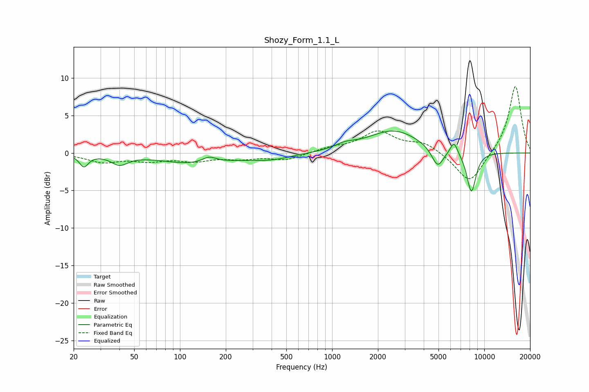

# Shozy_Form_1.1_L
See [usage instructions](https://github.com/jaakkopasanen/AutoEq#usage) for more options and info.

### Parametric EQs
Apply preamp of -3.0 dB when using parametric equalizer.

|   # | Type    |   Fc (Hz) |    Q |   Gain (dB) |
|-----|---------|-----------|------|-------------|
|   1 | Peaking |        23 | 4.82 |        -1.6 |
|   2 | Peaking |        40 | 2.6  |        -1.3 |
|   3 | Peaking |       125 | 0.64 |        -1.4 |
|   4 | Peaking |       155 | 2.92 |         0.9 |
|   5 | Peaking |       393 | 0.99 |        -0.8 |
|   6 | Peaking |      1215 | 2.2  |         0.6 |
|   7 | Peaking |      2543 | 0.82 |         3   |
|   8 | Peaking |      4934 | 3.49 |        -2.7 |
|   9 | Peaking |      6319 | 5.67 |         1.7 |
|  10 | Peaking |      8227 | 4.23 |        -5.4 |

### Fixed Band EQs
When using fixed band (also called graphic) equalizer, apply preamp of **-9.0 dB** (if available) and set gains manually with these parameters.

|   # | Type    |   Fc (Hz) |    Q |   Gain (dB) |
|-----|---------|-----------|------|-------------|
|   1 | Peaking |        31 | 1.41 |        -1.1 |
|   2 | Peaking |        62 | 1.41 |        -0.9 |
|   3 | Peaking |       125 | 1.41 |        -0.9 |
|   4 | Peaking |       250 | 1.41 |        -0.6 |
|   5 | Peaking |       500 | 1.41 |        -0.9 |
|   6 | Peaking |      1000 | 1.41 |         0.6 |
|   7 | Peaking |      2000 | 1.41 |         2.7 |
|   8 | Peaking |      4000 | 1.41 |         1.3 |
|   9 | Peaking |      8000 | 1.41 |        -4.2 |
|  10 | Peaking |     16000 | 1.41 |         9.1 |

### Graphs

