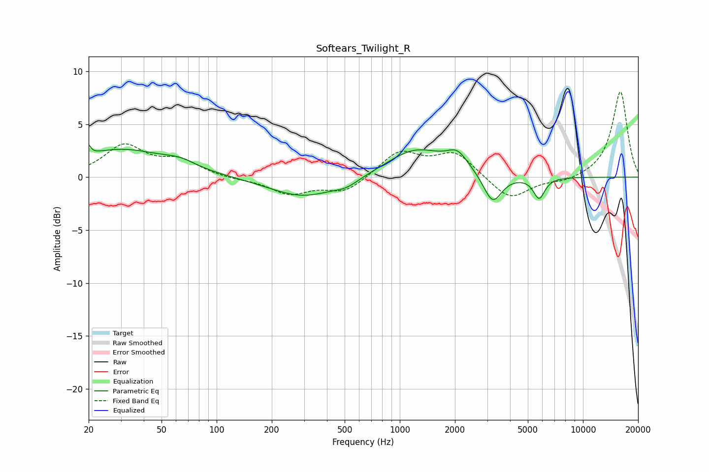

# Softears_Twilight_R
See [usage instructions](https://github.com/jaakkopasanen/AutoEq#usage) for more options and info.

### Parametric EQs
Apply preamp of -3.2 dB when using parametric equalizer.

|   # | Type    |   Fc (Hz) |    Q |   Gain (dB) |
|-----|---------|-----------|------|-------------|
|   1 | Peaking |        20 | 5.98 |         2.7 |
|   2 | Peaking |        20 | 5.99 |        -1.8 |
|   3 | Peaking |        30 | 0.6  |         2.5 |
|   4 | Peaking |        63 | 1.56 |         0.7 |
|   5 | Peaking |       297 | 0.77 |        -1.9 |
|   6 | Peaking |       512 | 2.09 |        -0.6 |
|   7 | Peaking |      1223 | 0.89 |         2.6 |
|   8 | Peaking |      2066 | 2.42 |         1.6 |
|   9 | Peaking |      3212 | 2.84 |        -2.8 |
|  10 | Peaking |      5763 | 4.49 |        -2   |

### Fixed Band EQs
When using fixed band (also called graphic) equalizer, apply preamp of **-8.1 dB** (if available) and set gains manually with these parameters.

|   # | Type    |   Fc (Hz) |    Q |   Gain (dB) |
|-----|---------|-----------|------|-------------|
|   1 | Peaking |        31 | 1.41 |         2.9 |
|   2 | Peaking |        62 | 1.41 |         1.4 |
|   3 | Peaking |       125 | 1.41 |        -0.2 |
|   4 | Peaking |       250 | 1.41 |        -1.5 |
|   5 | Peaking |       500 | 1.41 |        -1.4 |
|   6 | Peaking |      1000 | 1.41 |         2.4 |
|   7 | Peaking |      2000 | 1.41 |         2.3 |
|   8 | Peaking |      4000 | 1.41 |        -2.2 |
|   9 | Peaking |      8000 | 1.41 |        -0.4 |
|  10 | Peaking |     16000 | 1.41 |         8.1 |

### Graphs

