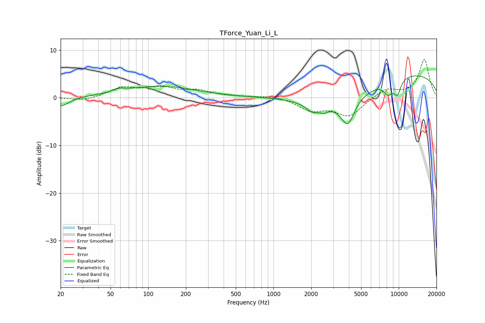

# TForce_Yuan_Li_L
See [usage instructions](https://github.com/jaakkopasanen/AutoEq#usage) for more options and info.

### Parametric EQs
Apply preamp of -4.7 dB when using parametric equalizer.

|   # | Type    |   Fc (Hz) |    Q |   Gain (dB) |
|-----|---------|-----------|------|-------------|
|   1 | Peaking |        20 | 2.22 |        -2   |
|   2 | Peaking |        59 | 2.85 |         0.6 |
|   3 | Peaking |       125 | 0.49 |         2.4 |
|   4 | Peaking |      2062 | 2.67 |        -1.6 |
|   5 | Peaking |      2519 | 5.73 |        -0.7 |
|   6 | Peaking |      3153 | 0.55 |        -5.5 |
|   7 | Peaking |      3920 | 2.82 |        -5   |
|   8 | Peaking |      8239 | 3.49 |        -2.6 |
|   9 | Peaking |      8647 | 0.18 |         5.7 |
|  10 | Peaking |      9746 | 4.41 |        -3.1 |

### Fixed Band EQs
When using fixed band (also called graphic) equalizer, apply preamp of **-8.1 dB** (if available) and set gains manually with these parameters.

|   # | Type    |   Fc (Hz) |    Q |   Gain (dB) |
|-----|---------|-----------|------|-------------|
|   1 | Peaking |        31 | 1.41 |        -0.7 |
|   2 | Peaking |        62 | 1.41 |         2   |
|   3 | Peaking |       125 | 1.41 |         2   |
|   4 | Peaking |       250 | 1.41 |         1.3 |
|   5 | Peaking |       500 | 1.41 |         0.2 |
|   6 | Peaking |      1000 | 1.41 |         0.5 |
|   7 | Peaking |      2000 | 1.41 |        -2.4 |
|   8 | Peaking |      4000 | 1.41 |        -3.7 |
|   9 | Peaking |      8000 | 1.41 |         1.9 |
|  10 | Peaking |     16000 | 1.41 |         8   |

### Graphs

