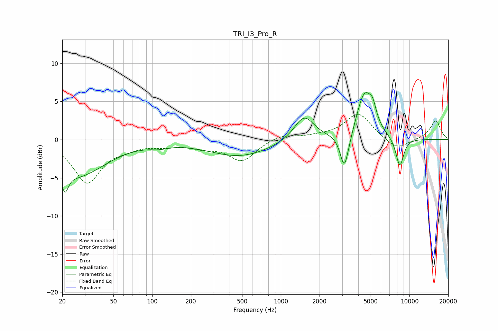

# TRI_I3_Pro_R
See [usage instructions](https://github.com/jaakkopasanen/AutoEq#usage) for more options and info.

### Parametric EQs
Apply preamp of -6.3 dB when using parametric equalizer.

|   # | Type    |   Fc (Hz) |    Q |   Gain (dB) |
|-----|---------|-----------|------|-------------|
|   1 | Peaking |        21 | 5.58 |        -2.5 |
|   2 | Peaking |        26 | 0.64 |        -4.7 |
|   3 | Peaking |       113 | 2.1  |        -0.4 |
|   4 | Peaking |       481 | 0.58 |        -2.2 |
|   5 | Peaking |      1517 | 1.8  |         3.3 |
|   6 | Peaking |      3113 | 4.39 |        -4.5 |
|   7 | Peaking |      3425 | 3.28 |        -0.8 |
|   8 | Peaking |      4487 | 2.14 |         6.2 |
|   9 | Peaking |      5189 | 5.35 |         1.6 |
|  10 | Peaking |      8405 | 4.11 |        -3.8 |

### Fixed Band EQs
When using fixed band (also called graphic) equalizer, apply preamp of **-3.4 dB** (if available) and set gains manually with these parameters.

|   # | Type    |   Fc (Hz) |    Q |   Gain (dB) |
|-----|---------|-----------|------|-------------|
|   1 | Peaking |        31 | 1.41 |        -5.5 |
|   2 | Peaking |        62 | 1.41 |        -0.7 |
|   3 | Peaking |       125 | 1.41 |        -0.6 |
|   4 | Peaking |       250 | 1.41 |        -0.8 |
|   5 | Peaking |       500 | 1.41 |        -2.7 |
|   6 | Peaking |      1000 | 1.41 |         0.7 |
|   7 | Peaking |      2000 | 1.41 |         0.3 |
|   8 | Peaking |      4000 | 1.41 |         3.4 |
|   9 | Peaking |      8000 | 1.41 |        -1.5 |
|  10 | Peaking |     16000 | 1.41 |         2.5 |

### Graphs

