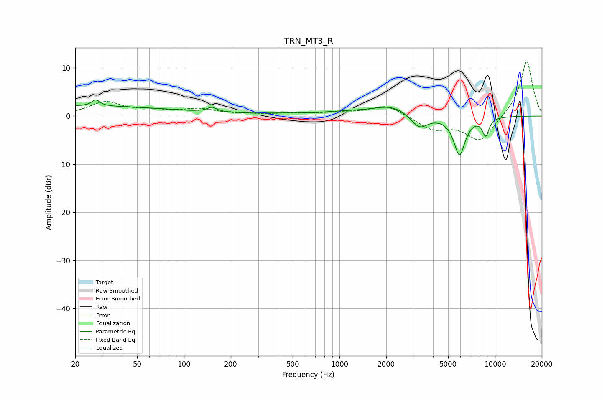

# TRN_MT3_R
See [usage instructions](https://github.com/jaakkopasanen/AutoEq#usage) for more options and info.

### Parametric EQs
Apply preamp of -3.4 dB when using parametric equalizer.

|   # | Type    |   Fc (Hz) |    Q |   Gain (dB) |
|-----|---------|-----------|------|-------------|
|   1 | Peaking |        20 | 0.19 |         2.1 |
|   2 | Peaking |        27 | 5.75 |         1.3 |
|   3 | Peaking |       151 | 4.64 |         1   |
|   4 | Peaking |       204 | 2.27 |         0.1 |
|   5 | Peaking |       379 | 1.15 |         0.3 |
|   6 | Peaking |      1118 | 0.73 |         0.8 |
|   7 | Peaking |      2191 | 1.25 |         1.9 |
|   8 | Peaking |      3257 | 2.55 |        -2.9 |
|   9 | Peaking |      5911 | 3.73 |        -8   |
|  10 | Peaking |      8716 | 6    |        -3.6 |

### Fixed Band EQs
When using fixed band (also called graphic) equalizer, apply preamp of **-11.4 dB** (if available) and set gains manually with these parameters.

|   # | Type    |   Fc (Hz) |    Q |   Gain (dB) |
|-----|---------|-----------|------|-------------|
|   1 | Peaking |        31 | 1.41 |         2.8 |
|   2 | Peaking |        62 | 1.41 |         0.9 |
|   3 | Peaking |       125 | 1.41 |         1.3 |
|   4 | Peaking |       250 | 1.41 |         0.2 |
|   5 | Peaking |       500 | 1.41 |         0.5 |
|   6 | Peaking |      1000 | 1.41 |         0.6 |
|   7 | Peaking |      2000 | 1.41 |         2.3 |
|   8 | Peaking |      4000 | 1.41 |        -2.7 |
|   9 | Peaking |      8000 | 1.41 |        -5.3 |
|  10 | Peaking |     16000 | 1.41 |        11.6 |

### Graphs

