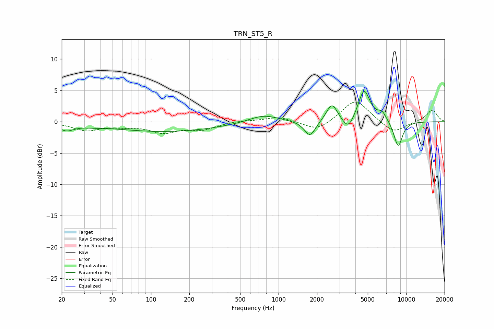

# TRN_ST5_R
See [usage instructions](https://github.com/jaakkopasanen/AutoEq#usage) for more options and info.

### Parametric EQs
Apply preamp of -4.9 dB when using parametric equalizer.

|   # | Type    |   Fc (Hz) |    Q |   Gain (dB) |
|-----|---------|-----------|------|-------------|
|   1 | Peaking |        22 | 2.36 |        -1.1 |
|   2 | Peaking |        35 | 1.79 |        -0.2 |
|   3 | Peaking |       131 | 0.34 |        -1.6 |
|   4 | Peaking |       762 | 1.2  |         1.2 |
|   5 | Peaking |      1764 | 3.23 |        -2.5 |
|   6 | Peaking |      2619 | 3.25 |         2.9 |
|   7 | Peaking |      3520 | 3.21 |        -2.1 |
|   8 | Peaking |      4674 | 2.99 |         5.1 |
|   9 | Peaking |      6481 | 3.77 |         1.3 |
|  10 | Peaking |      8653 | 3.73 |        -4.2 |

### Fixed Band EQs
When using fixed band (also called graphic) equalizer, apply preamp of **-3.2 dB** (if available) and set gains manually with these parameters.

|   # | Type    |   Fc (Hz) |    Q |   Gain (dB) |
|-----|---------|-----------|------|-------------|
|   1 | Peaking |        31 | 1.41 |        -1.3 |
|   2 | Peaking |        62 | 1.41 |        -0.5 |
|   3 | Peaking |       125 | 1.41 |        -1.6 |
|   4 | Peaking |       250 | 1.41 |        -1.1 |
|   5 | Peaking |       500 | 1.41 |         0.2 |
|   6 | Peaking |      1000 | 1.41 |         0.8 |
|   7 | Peaking |      2000 | 1.41 |        -1.6 |
|   8 | Peaking |      4000 | 1.41 |         3.6 |
|   9 | Peaking |      8000 | 1.41 |        -1.9 |
|  10 | Peaking |     16000 | 1.41 |         1.9 |

### Graphs

