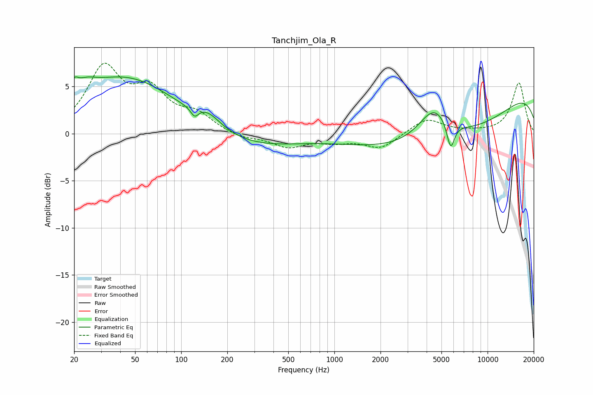

# Tanchjim_Ola_R
See [usage instructions](https://github.com/jaakkopasanen/AutoEq#usage) for more options and info.

### Parametric EQs
Apply preamp of -6.1 dB when using parametric equalizer.

|   # | Type    |   Fc (Hz) |    Q |   Gain (dB) |
|-----|---------|-----------|------|-------------|
|   1 | Peaking |        20 | 6    |         1.1 |
|   2 | Peaking |        23 | 1.9  |         1.3 |
|   3 | Peaking |        44 | 0.42 |         5.9 |
|   4 | Peaking |       122 | 5.49 |        -1   |
|   5 | Peaking |       149 | 1.64 |         1.4 |
|   6 | Peaking |       267 | 0.46 |        -1.6 |
|   7 | Peaking |      4473 | 1.38 |         3.6 |
|   8 | Peaking |      5463 | 0.29 |        -6.3 |
|   9 | Peaking |      5739 | 5.41 |        -2.9 |
|  10 | Peaking |     10000 | 0.2  |         6.1 |

### Fixed Band EQs
When using fixed band (also called graphic) equalizer, apply preamp of **-7.6 dB** (if available) and set gains manually with these parameters.

|   # | Type    |   Fc (Hz) |    Q |   Gain (dB) |
|-----|---------|-----------|------|-------------|
|   1 | Peaking |        31 | 1.41 |         6.7 |
|   2 | Peaking |        62 | 1.41 |         3.9 |
|   3 | Peaking |       125 | 1.41 |         1.8 |
|   4 | Peaking |       250 | 1.41 |        -0.5 |
|   5 | Peaking |       500 | 1.41 |        -1.4 |
|   6 | Peaking |      1000 | 1.41 |        -0.7 |
|   7 | Peaking |      2000 | 1.41 |        -1.6 |
|   8 | Peaking |      4000 | 1.41 |         1.6 |
|   9 | Peaking |      8000 | 1.41 |         0.1 |
|  10 | Peaking |     16000 | 1.41 |         5.4 |

### Graphs

