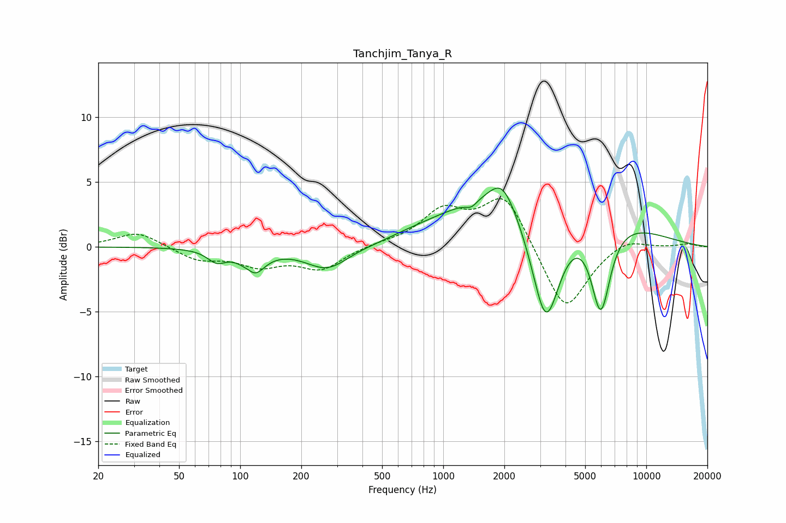

# Tanchjim_Tanya_R
See [usage instructions](https://github.com/jaakkopasanen/AutoEq#usage) for more options and info.

### Parametric EQs
Apply preamp of -4.6 dB when using parametric equalizer.

|   # | Type    |   Fc (Hz) |    Q |   Gain (dB) |
|-----|---------|-----------|------|-------------|
|   1 | Peaking |        77 | 3.13 |        -0.9 |
|   2 | Peaking |       111 | 4.32 |         0.6 |
|   3 | Peaking |       115 | 2.73 |        -2.2 |
|   4 | Peaking |       269 | 1.32 |        -1.9 |
|   5 | Peaking |       470 | 1.58 |        -0.1 |
|   6 | Peaking |      1378 | 5.03 |        -0.5 |
|   7 | Peaking |      1952 | 2.21 |         2.1 |
|   8 | Peaking |      2825 | 0.34 |         5.2 |
|   9 | Peaking |      3202 | 1.8  |       -10   |
|  10 | Peaking |      5968 | 2.81 |        -7.2 |

### Fixed Band EQs
When using fixed band (also called graphic) equalizer, apply preamp of **-3.8 dB** (if available) and set gains manually with these parameters.

|   # | Type    |   Fc (Hz) |    Q |   Gain (dB) |
|-----|---------|-----------|------|-------------|
|   1 | Peaking |        31 | 1.41 |         1.2 |
|   2 | Peaking |        62 | 1.41 |        -1   |
|   3 | Peaking |       125 | 1.41 |        -1.3 |
|   4 | Peaking |       250 | 1.41 |        -1.7 |
|   5 | Peaking |       500 | 1.41 |         0.2 |
|   6 | Peaking |      1000 | 1.41 |         2.6 |
|   7 | Peaking |      2000 | 1.41 |         4.1 |
|   8 | Peaking |      4000 | 1.41 |        -5.2 |
|   9 | Peaking |      8000 | 1.41 |         0.8 |
|  10 | Peaking |     16000 | 1.41 |         0.2 |

### Graphs

