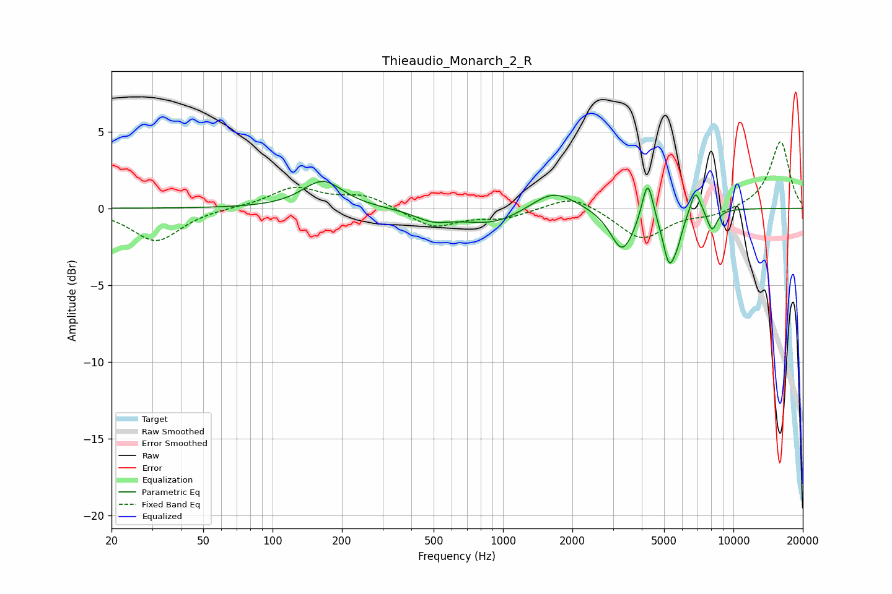

# Thieaudio_Monarch_2_R
See [usage instructions](https://github.com/jaakkopasanen/AutoEq#usage) for more options and info.

### Parametric EQs
Apply preamp of -1.8 dB when using parametric equalizer.

|   # | Type    |   Fc (Hz) |    Q |   Gain (dB) |
|-----|---------|-----------|------|-------------|
|   1 | Peaking |       165 | 1.62 |         1.8 |
|   2 | Peaking |       494 | 1.85 |        -0.6 |
|   3 | Peaking |       898 | 1    |        -1.1 |
|   4 | Peaking |      1650 | 1.46 |         1.4 |
|   5 | Peaking |      3296 | 2.74 |        -2.8 |
|   6 | Peaking |      4241 | 6    |         2.7 |
|   7 | Peaking |      5258 | 4.94 |        -3.2 |
|   8 | Peaking |      5728 | 6    |        -1   |
|   9 | Peaking |      6844 | 5.98 |         1.6 |
|  10 | Peaking |      8076 | 6    |        -1.4 |

### Fixed Band EQs
When using fixed band (also called graphic) equalizer, apply preamp of **-4.4 dB** (if available) and set gains manually with these parameters.

|   # | Type    |   Fc (Hz) |    Q |   Gain (dB) |
|-----|---------|-----------|------|-------------|
|   1 | Peaking |        31 | 1.41 |        -2.2 |
|   2 | Peaking |        62 | 1.41 |         0.1 |
|   3 | Peaking |       125 | 1.41 |         1.3 |
|   4 | Peaking |       250 | 1.41 |         0.8 |
|   5 | Peaking |       500 | 1.41 |        -1.2 |
|   6 | Peaking |      1000 | 1.41 |        -0.6 |
|   7 | Peaking |      2000 | 1.41 |         1   |
|   8 | Peaking |      4000 | 1.41 |        -2   |
|   9 | Peaking |      8000 | 1.41 |        -0.4 |
|  10 | Peaking |     16000 | 1.41 |         4.4 |

### Graphs

