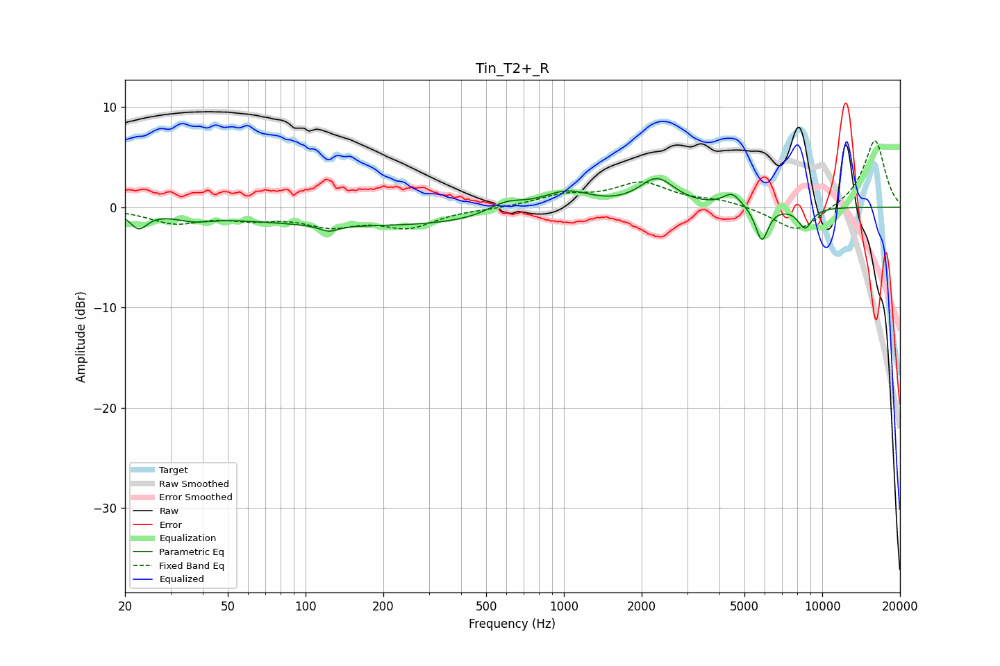

# Tin_T2+_R
See [usage instructions](https://github.com/jaakkopasanen/AutoEq#usage) for more options and info.

### Parametric EQs
Apply preamp of -2.9 dB when using parametric equalizer.

|   # | Type    |   Fc (Hz) |    Q |   Gain (dB) |
|-----|---------|-----------|------|-------------|
|   1 | Peaking |        23 | 4.32 |        -1.7 |
|   2 | Peaking |        37 | 2.1  |        -0.6 |
|   3 | Peaking |       123 | 3.91 |        -0.6 |
|   4 | Peaking |       213 | 0.21 |        -1.9 |
|   5 | Peaking |       599 | 1.85 |         1.3 |
|   6 | Peaking |      1015 | 1.37 |         2.1 |
|   7 | Peaking |      2292 | 2.06 |         2.8 |
|   8 | Peaking |      4479 | 4.03 |         1.3 |
|   9 | Peaking |      5839 | 5.63 |        -3.4 |
|  10 | Peaking |      8586 | 4.61 |        -2   |

### Fixed Band EQs
When using fixed band (also called graphic) equalizer, apply preamp of **-6.7 dB** (if available) and set gains manually with these parameters.

|   # | Type    |   Fc (Hz) |    Q |   Gain (dB) |
|-----|---------|-----------|------|-------------|
|   1 | Peaking |        31 | 1.41 |        -1.5 |
|   2 | Peaking |        62 | 1.41 |        -0.9 |
|   3 | Peaking |       125 | 1.41 |        -1.6 |
|   4 | Peaking |       250 | 1.41 |        -1.8 |
|   5 | Peaking |       500 | 1.41 |        -0.1 |
|   6 | Peaking |      1000 | 1.41 |         1.1 |
|   7 | Peaking |      2000 | 1.41 |         2.3 |
|   8 | Peaking |      4000 | 1.41 |         0.6 |
|   9 | Peaking |      8000 | 1.41 |        -2.6 |
|  10 | Peaking |     16000 | 1.41 |         6.8 |

### Graphs

