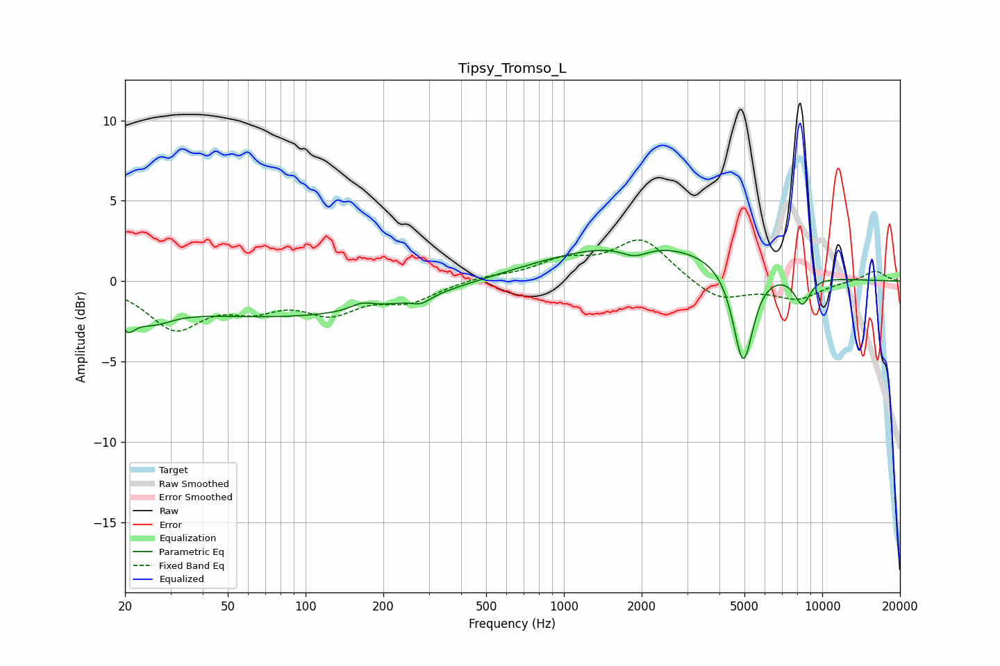

# Tipsy_Tromso_L
See [usage instructions](https://github.com/jaakkopasanen/AutoEq#usage) for more options and info.

### Parametric EQs
Apply preamp of -2.0 dB when using parametric equalizer.

|   # | Type    |   Fc (Hz) |    Q |   Gain (dB) |
|-----|---------|-----------|------|-------------|
|   1 | Peaking |        20 | 4.54 |        -1.4 |
|   2 | Peaking |        25 | 1.8  |        -1.1 |
|   3 | Peaking |        82 | 0.25 |        -2.2 |
|   4 | Peaking |       165 | 3.28 |         0.4 |
|   5 | Peaking |       281 | 3.86 |        -0.4 |
|   6 | Peaking |      1238 | 0.28 |         0.3 |
|   7 | Peaking |      1876 | 2.65 |        -0.7 |
|   8 | Peaking |      2065 | 0.38 |         2.1 |
|   9 | Peaking |      4942 | 3.56 |        -6.2 |
|  10 | Peaking |      8370 | 4.13 |        -1.8 |

### Fixed Band EQs
When using fixed band (also called graphic) equalizer, apply preamp of **-2.7 dB** (if available) and set gains manually with these parameters.

|   # | Type    |   Fc (Hz) |    Q |   Gain (dB) |
|-----|---------|-----------|------|-------------|
|   1 | Peaking |        31 | 1.41 |        -2.8 |
|   2 | Peaking |        62 | 1.41 |        -1.3 |
|   3 | Peaking |       125 | 1.41 |        -1.7 |
|   4 | Peaking |       250 | 1.41 |        -1.1 |
|   5 | Peaking |       500 | 1.41 |         0.3 |
|   6 | Peaking |      1000 | 1.41 |         1.1 |
|   7 | Peaking |      2000 | 1.41 |         2.6 |
|   8 | Peaking |      4000 | 1.41 |        -1.3 |
|   9 | Peaking |      8000 | 1.41 |        -1.1 |
|  10 | Peaking |     16000 | 1.41 |         0.7 |

### Graphs

