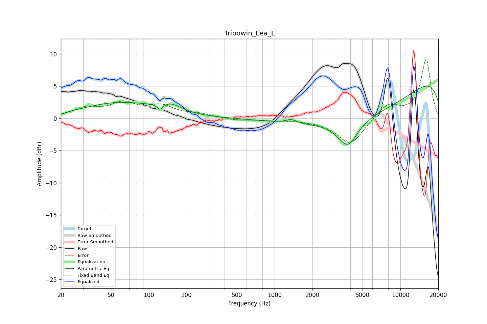

# Tripowin_Lea_L
See [usage instructions](https://github.com/jaakkopasanen/AutoEq#usage) for more options and info.

### Parametric EQs
Apply preamp of -5.1 dB when using parametric equalizer.

|   # | Type    |   Fc (Hz) |    Q |   Gain (dB) |
|-----|---------|-----------|------|-------------|
|   1 | Peaking |        20 | 4.9  |        -0.3 |
|   2 | Peaking |        60 | 0.48 |         2.4 |
|   3 | Peaking |        68 | 2.86 |        -0.1 |
|   4 | Peaking |       123 | 5.99 |        -1   |
|   5 | Peaking |       148 | 1.66 |         1.2 |
|   6 | Peaking |      1356 | 3.69 |         0.6 |
|   7 | Peaking |      3821 | 1.75 |        -4.2 |
|   8 | Peaking |      4742 | 5.93 |         0.1 |
|   9 | Peaking |      5354 | 0.28 |        -7.2 |
|  10 | Peaking |      9658 | 0.18 |         8.8 |

### Fixed Band EQs
When using fixed band (also called graphic) equalizer, apply preamp of **-9.2 dB** (if available) and set gains manually with these parameters.

|   # | Type    |   Fc (Hz) |    Q |   Gain (dB) |
|-----|---------|-----------|------|-------------|
|   1 | Peaking |        31 | 1.41 |         1.4 |
|   2 | Peaking |        62 | 1.41 |         2.1 |
|   3 | Peaking |       125 | 1.41 |         1.7 |
|   4 | Peaking |       250 | 1.41 |         0.6 |
|   5 | Peaking |       500 | 1.41 |        -0.3 |
|   6 | Peaking |      1000 | 1.41 |        -0.3 |
|   7 | Peaking |      2000 | 1.41 |        -0.2 |
|   8 | Peaking |      4000 | 1.41 |        -4.1 |
|   9 | Peaking |      8000 | 1.41 |         2.2 |
|  10 | Peaking |     16000 | 1.41 |         9.1 |

### Graphs

