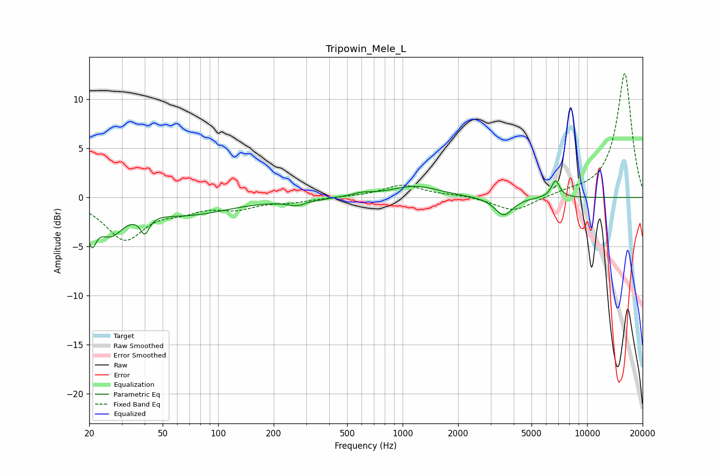

# Tripowin_Mele_L
See [usage instructions](https://github.com/jaakkopasanen/AutoEq#usage) for more options and info.

### Parametric EQs
Apply preamp of -1.8 dB when using parametric equalizer.

|   # | Type    |   Fc (Hz) |    Q |   Gain (dB) |
|-----|---------|-----------|------|-------------|
|   1 | Peaking |        21 | 5.85 |        -3.1 |
|   2 | Peaking |        26 | 2.03 |        -3   |
|   3 | Peaking |        40 | 5.91 |        -1.8 |
|   4 | Peaking |        67 | 0.61 |        -1.7 |
|   5 | Peaking |       281 | 2.4  |        -0.9 |
|   6 | Peaking |       297 | 3.37 |         0.4 |
|   7 | Peaking |       603 | 2.66 |         0.3 |
|   8 | Peaking |      1166 | 1.09 |         1.2 |
|   9 | Peaking |      3534 | 2.91 |        -1.9 |
|  10 | Peaking |      6747 | 5.91 |         1.8 |

### Fixed Band EQs
When using fixed band (also called graphic) equalizer, apply preamp of **-12.7 dB** (if available) and set gains manually with these parameters.

|   # | Type    |   Fc (Hz) |    Q |   Gain (dB) |
|-----|---------|-----------|------|-------------|
|   1 | Peaking |        31 | 1.41 |        -4.1 |
|   2 | Peaking |        62 | 1.41 |        -1   |
|   3 | Peaking |       125 | 1.41 |        -1   |
|   4 | Peaking |       250 | 1.41 |        -0.4 |
|   5 | Peaking |       500 | 1.41 |         0   |
|   6 | Peaking |      1000 | 1.41 |         1.3 |
|   7 | Peaking |      2000 | 1.41 |         0.2 |
|   8 | Peaking |      4000 | 1.41 |        -1.5 |
|   9 | Peaking |      8000 | 1.41 |         0.4 |
|  10 | Peaking |     16000 | 1.41 |        12.7 |

### Graphs

