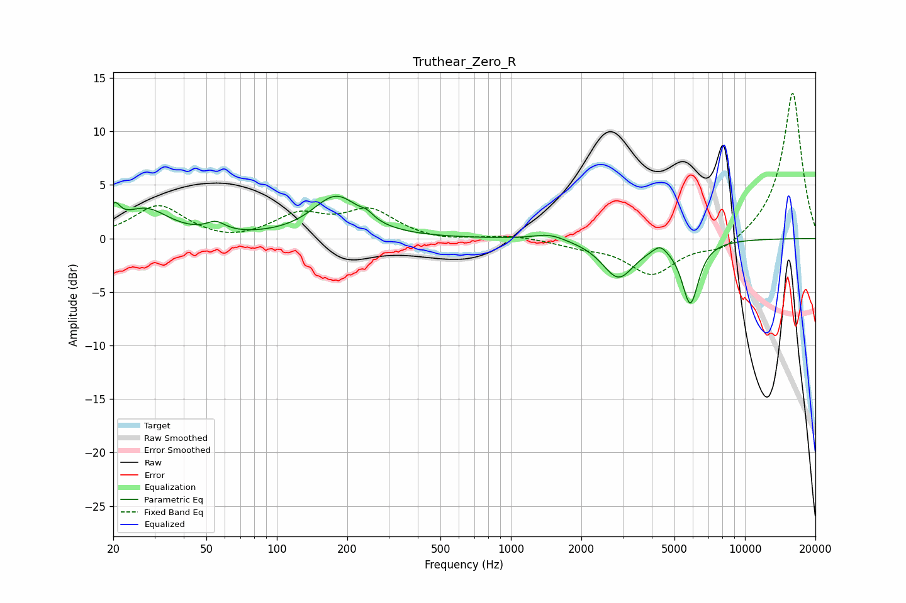

# Truthear_Zero_R
See [usage instructions](https://github.com/jaakkopasanen/AutoEq#usage) for more options and info.

### Parametric EQs
Apply preamp of -4.0 dB when using parametric equalizer.

|   # | Type    |   Fc (Hz) |    Q |   Gain (dB) |
|-----|---------|-----------|------|-------------|
|   1 | Peaking |        20 | 5.98 |        -1   |
|   2 | Peaking |        20 | 5.91 |         2.9 |
|   3 | Peaking |        27 | 1.42 |         2.6 |
|   4 | Peaking |        55 | 3.51 |         0.9 |
|   5 | Peaking |       179 | 1.41 |         3.9 |
|   6 | Peaking |       243 | 5.34 |         0.5 |
|   7 | Peaking |      1462 | 2.08 |         0.6 |
|   8 | Peaking |      2880 | 2.06 |        -3.6 |
|   9 | Peaking |      4339 | 4.8  |         0.7 |
|  10 | Peaking |      5842 | 3.88 |        -5.8 |

### Fixed Band EQs
When using fixed band (also called graphic) equalizer, apply preamp of **-13.7 dB** (if available) and set gains manually with these parameters.

|   # | Type    |   Fc (Hz) |    Q |   Gain (dB) |
|-----|---------|-----------|------|-------------|
|   1 | Peaking |        31 | 1.41 |         3.1 |
|   2 | Peaking |        62 | 1.41 |        -0.5 |
|   3 | Peaking |       125 | 1.41 |         2.1 |
|   4 | Peaking |       250 | 1.41 |         2.5 |
|   5 | Peaking |       500 | 1.41 |        -0.3 |
|   6 | Peaking |      1000 | 1.41 |         0.3 |
|   7 | Peaking |      2000 | 1.41 |        -0.6 |
|   8 | Peaking |      4000 | 1.41 |        -3.3 |
|   9 | Peaking |      8000 | 1.41 |        -1.3 |
|  10 | Peaking |     16000 | 1.41 |        13.8 |

### Graphs

