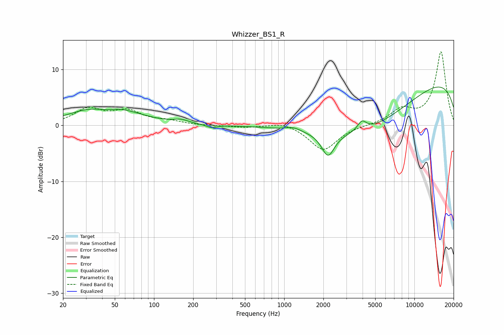

# Whizzer_BS1_R
See [usage instructions](https://github.com/jaakkopasanen/AutoEq#usage) for more options and info.

### Parametric EQs
Apply preamp of -7.0 dB when using parametric equalizer.

|   # | Type    |   Fc (Hz) |    Q |   Gain (dB) |
|-----|---------|-----------|------|-------------|
|   1 | Peaking |        40 | 0.69 |         1.8 |
|   2 | Peaking |        42 | 1.48 |        -1.4 |
|   3 | Peaking |        43 | 0.67 |         2.5 |
|   4 | Peaking |       162 | 2.61 |         0.6 |
|   5 | Peaking |       278 | 3.55 |        -0.6 |
|   6 | Peaking |      1171 | 2.48 |         0.6 |
|   7 | Peaking |      2171 | 2.88 |        -4.2 |
|   8 | Peaking |      3952 | 4.08 |         1.8 |
|   9 | Peaking |      4374 | 0.37 |        -8.3 |
|  10 | Peaking |     10000 | 0.18 |         9.5 |

### Fixed Band EQs
When using fixed band (also called graphic) equalizer, apply preamp of **-13.2 dB** (if available) and set gains manually with these parameters.

|   # | Type    |   Fc (Hz) |    Q |   Gain (dB) |
|-----|---------|-----------|------|-------------|
|   1 | Peaking |        31 | 1.41 |         2.8 |
|   2 | Peaking |        62 | 1.41 |         2.3 |
|   3 | Peaking |       125 | 1.41 |         0.7 |
|   4 | Peaking |       250 | 1.41 |        -0.1 |
|   5 | Peaking |       500 | 1.41 |        -0.3 |
|   6 | Peaking |      1000 | 1.41 |         0.7 |
|   7 | Peaking |      2000 | 1.41 |        -4.5 |
|   8 | Peaking |      4000 | 1.41 |        -0   |
|   9 | Peaking |      8000 | 1.41 |         2.6 |
|  10 | Peaking |     16000 | 1.41 |        13.1 |

### Graphs

