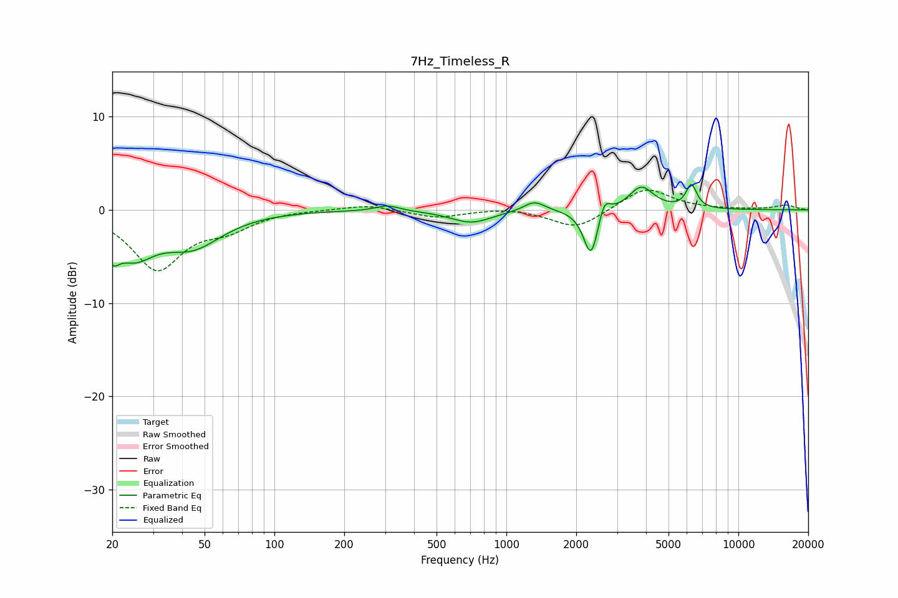

# 7Hz_Timeless_R
See [usage instructions](https://github.com/jaakkopasanen/AutoEq#usage) for more options and info.

### Parametric EQs
Apply preamp of -2.8 dB when using parametric equalizer.

|   # | Type    |   Fc (Hz) |    Q |   Gain (dB) |
|-----|---------|-----------|------|-------------|
|   1 | Peaking |        20 | 4.78 |        -2.5 |
|   2 | Peaking |        25 | 1.59 |        -4   |
|   3 | Peaking |        44 | 1.09 |        -3.5 |
|   4 | Peaking |       307 | 2.81 |         0.6 |
|   5 | Peaking |       705 | 1.59 |        -1.4 |
|   6 | Peaking |      1321 | 3.09 |         1.1 |
|   7 | Peaking |      2317 | 4.49 |        -5.2 |
|   8 | Peaking |      2639 | 5.88 |         2   |
|   9 | Peaking |      3815 | 2.68 |         2.5 |
|  10 | Peaking |      6273 | 6    |         2.5 |

### Fixed Band EQs
When using fixed band (also called graphic) equalizer, apply preamp of **-2.2 dB** (if available) and set gains manually with these parameters.

|   # | Type    |   Fc (Hz) |    Q |   Gain (dB) |
|-----|---------|-----------|------|-------------|
|   1 | Peaking |        31 | 1.41 |        -6.2 |
|   2 | Peaking |        62 | 1.41 |        -1.7 |
|   3 | Peaking |       125 | 1.41 |         0   |
|   4 | Peaking |       250 | 1.41 |         0.6 |
|   5 | Peaking |       500 | 1.41 |        -0.8 |
|   6 | Peaking |      1000 | 1.41 |         0.3 |
|   7 | Peaking |      2000 | 1.41 |        -2.1 |
|   8 | Peaking |      4000 | 1.41 |         2.4 |
|   9 | Peaking |      8000 | 1.41 |         0   |
|  10 | Peaking |     16000 | 1.41 |         0.5 |

### Graphs

