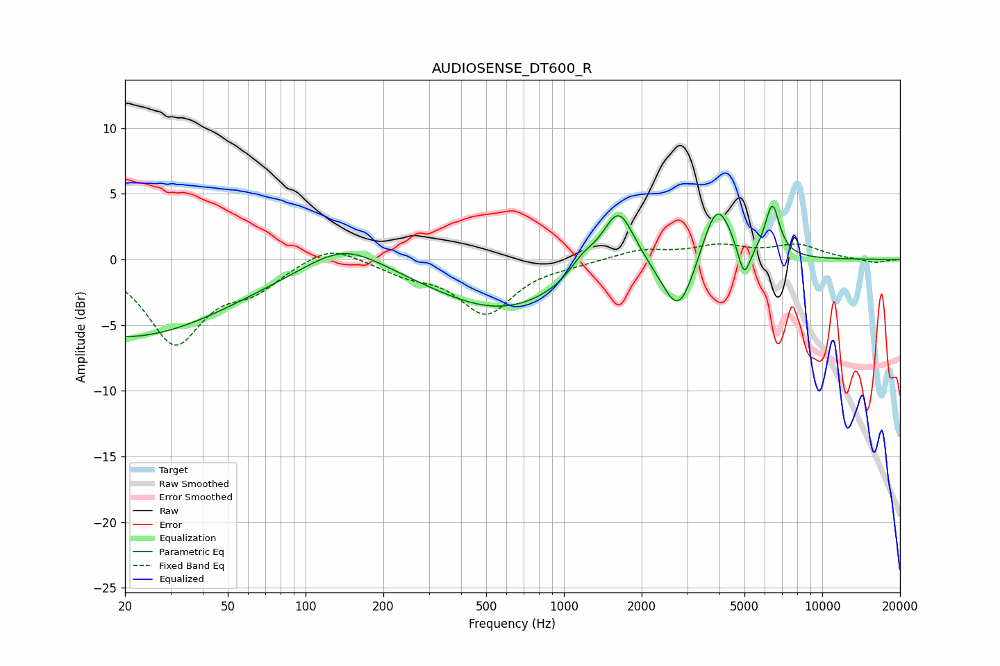

# AUDIOSENSE_DT600_R
See [usage instructions](https://github.com/jaakkopasanen/AutoEq#usage) for more options and info.

### Parametric EQs
Apply preamp of -4.1 dB when using parametric equalizer.

|   # | Type    |   Fc (Hz) |    Q |   Gain (dB) |
|-----|---------|-----------|------|-------------|
|   1 | Peaking |        20 | 0.34 |        -5.9 |
|   2 | Peaking |       141 | 0.96 |         2.1 |
|   3 | Peaking |       574 | 0.53 |        -3.8 |
|   4 | Peaking |      1183 | 2.6  |         1.3 |
|   5 | Peaking |      1627 | 2.23 |         4.8 |
|   6 | Peaking |      2783 | 2.25 |        -4.5 |
|   7 | Peaking |      3917 | 2.39 |         4.9 |
|   8 | Peaking |      4941 | 4.64 |        -0.6 |
|   9 | Peaking |      4992 | 6    |        -2   |
|  10 | Peaking |      6409 | 4.89 |         3.9 |

### Fixed Band EQs
When using fixed band (also called graphic) equalizer, apply preamp of **-1.3 dB** (if available) and set gains manually with these parameters.

|   # | Type    |   Fc (Hz) |    Q |   Gain (dB) |
|-----|---------|-----------|------|-------------|
|   1 | Peaking |        31 | 1.41 |        -6.2 |
|   2 | Peaking |        62 | 1.41 |        -1.9 |
|   3 | Peaking |       125 | 1.41 |         1.3 |
|   4 | Peaking |       250 | 1.41 |        -0.9 |
|   5 | Peaking |       500 | 1.41 |        -4   |
|   6 | Peaking |      1000 | 1.41 |        -0.3 |
|   7 | Peaking |      2000 | 1.41 |         0.7 |
|   8 | Peaking |      4000 | 1.41 |         0.9 |
|   9 | Peaking |      8000 | 1.41 |         1   |
|  10 | Peaking |     16000 | 1.41 |        -0.3 |

### Graphs

