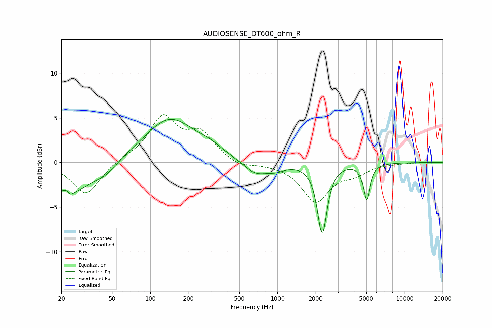

# AUDIOSENSE_DT600_ohm_R
See [usage instructions](https://github.com/jaakkopasanen/AutoEq#usage) for more options and info.

### Parametric EQs
Apply preamp of -4.9 dB when using parametric equalizer.

|   # | Type    |   Fc (Hz) |    Q |   Gain (dB) |
|-----|---------|-----------|------|-------------|
|   1 | Peaking |        22 | 6    |         2.8 |
|   2 | Peaking |        23 | 5.38 |        -2.9 |
|   3 | Peaking |        23 | 0.81 |        -3.3 |
|   4 | Peaking |        44 | 1.68 |        -0.9 |
|   5 | Peaking |       142 | 0.71 |         4.9 |
|   6 | Peaking |       295 | 1.53 |         0.7 |
|   7 | Peaking |       671 | 1.53 |        -1.4 |
|   8 | Peaking |       975 | 1.97 |        -0.6 |
|   9 | Peaking |      2248 | 3.8  |        -7.8 |
|  10 | Peaking |      5037 | 5.42 |        -4   |

### Fixed Band EQs
When using fixed band (also called graphic) equalizer, apply preamp of **-5.4 dB** (if available) and set gains manually with these parameters.

|   # | Type    |   Fc (Hz) |    Q |   Gain (dB) |
|-----|---------|-----------|------|-------------|
|   1 | Peaking |        31 | 1.41 |        -3.7 |
|   2 | Peaking |        62 | 1.41 |         0.3 |
|   3 | Peaking |       125 | 1.41 |         4.9 |
|   4 | Peaking |       250 | 1.41 |         3   |
|   5 | Peaking |       500 | 1.41 |        -0.6 |
|   6 | Peaking |      1000 | 1.41 |        -0.1 |
|   7 | Peaking |      2000 | 1.41 |        -4.3 |
|   8 | Peaking |      4000 | 1.41 |        -1   |
|   9 | Peaking |      8000 | 1.41 |        -0.1 |
|  10 | Peaking |     16000 | 1.41 |         0.1 |

### Graphs

