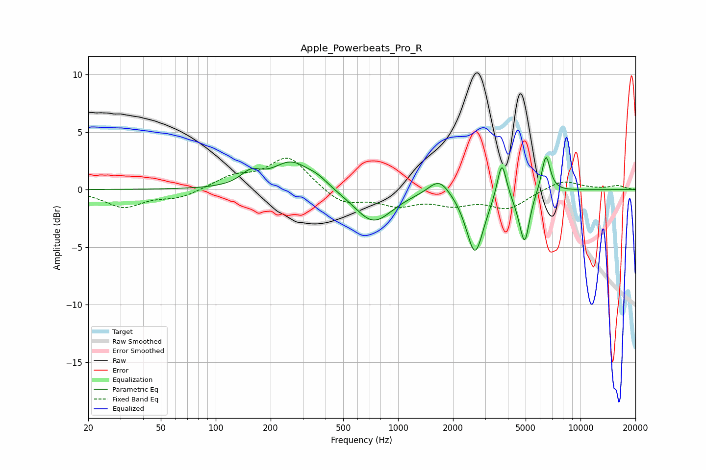

# Apple_Powerbeats_Pro_R
See [usage instructions](https://github.com/jaakkopasanen/AutoEq#usage) for more options and info.

### Parametric EQs
Apply preamp of -2.9 dB when using parametric equalizer.

|   # | Type    |   Fc (Hz) |    Q |   Gain (dB) |
|-----|---------|-----------|------|-------------|
|   1 | Peaking |       156 | 2.55 |         1.1 |
|   2 | Peaking |       259 | 1.4  |         2.3 |
|   3 | Peaking |       362 | 2.29 |         0.6 |
|   4 | Peaking |       732 | 1.37 |        -2.9 |
|   5 | Peaking |      1681 | 2.43 |         1.5 |
|   6 | Peaking |      2639 | 2.99 |        -5.5 |
|   7 | Peaking |      3703 | 5.68 |         3.4 |
|   8 | Peaking |      4690 | 3.69 |        -0.8 |
|   9 | Peaking |      4951 | 5.4  |        -3.9 |
|  10 | Peaking |      6464 | 5.8  |         3.3 |

### Fixed Band EQs
When using fixed band (also called graphic) equalizer, apply preamp of **-2.8 dB** (if available) and set gains manually with these parameters.

|   # | Type    |   Fc (Hz) |    Q |   Gain (dB) |
|-----|---------|-----------|------|-------------|
|   1 | Peaking |        31 | 1.41 |        -1.5 |
|   2 | Peaking |        62 | 1.41 |        -0.7 |
|   3 | Peaking |       125 | 1.41 |         1   |
|   4 | Peaking |       250 | 1.41 |         2.8 |
|   5 | Peaking |       500 | 1.41 |        -1.3 |
|   6 | Peaking |      1000 | 1.41 |        -1.2 |
|   7 | Peaking |      2000 | 1.41 |        -1.1 |
|   8 | Peaking |      4000 | 1.41 |        -1.5 |
|   9 | Peaking |      8000 | 1.41 |         0.9 |
|  10 | Peaking |     16000 | 1.41 |         0.3 |

### Graphs

